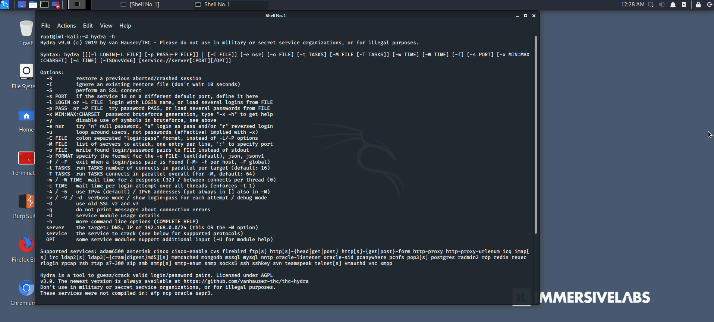

# Hydra: Brute Force

Many web-based services require a simple username and password to authenticate users. One way to overcome this method of authentication is to use a brute force attack, which involves repeatedly guessing the user’s credentials until the correct information is identified.

Hydra is one of many tools used to perform this type of attack, and can be executed against a wide range of protocols. In this lab we will introduce Hydra and its uses.

MITRE | ATT&CK Framework [T1110 Brute Force](https://attack.mitre.org/versions/v6/techniques/T1110/) 

MITRE | ATT&CK Framework [T1078 Valid Accounts](https://attack.mitre.org/versions/v6/techniques/T1078/) 

## Lab


Tasks
1. Understand how Hydra is used to brute force an authentication service.
2. Use Hydra to brute force the FTP server.
3. The wordlist required for this lab can be found in /usr/share/wordlists/metasploit/password.lst

In order to solve this challenge, I opened up 2 terminal shells.
In one I ran this command, because I knew it would take a while for it to run.
```hydra -l root -P /usr/share/wordlists/metasploit/password.lst ftp://10.102.10.221```

While that one is cooking, in the other terminal, I ran the command
```hydra -h```
and started answering some of the questions below.



### Question 1
Which option is used to specify the port a service is running on?
-s

### Question 2
Which option is used to show the login and password for each attempt WITHOUT any detailed debugging information?
-V

### Question 3
Which option is used to brute force a service using a file containing colon separated usernames and passwords, in the format “login:pass”?
-C

### Question 4
What is the default number of connections Hydra will run in parallel?
16

### Question 5
What is jimmy’s password for the FTP server?
