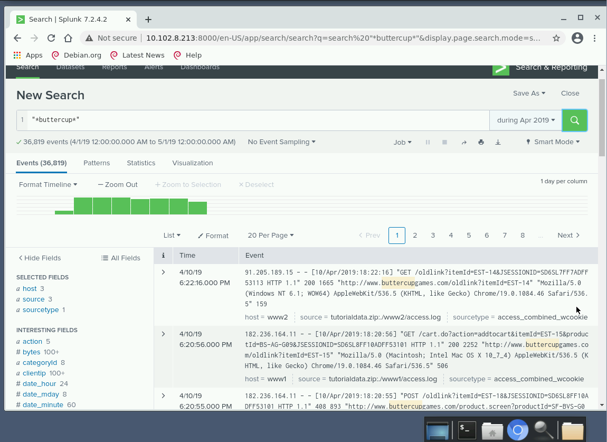
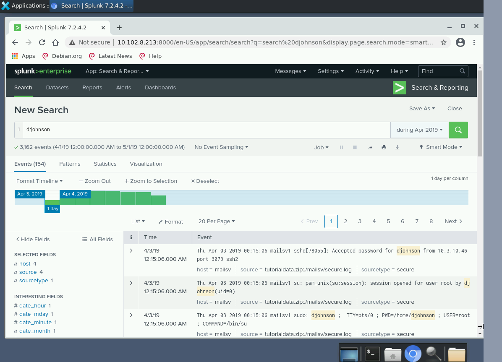
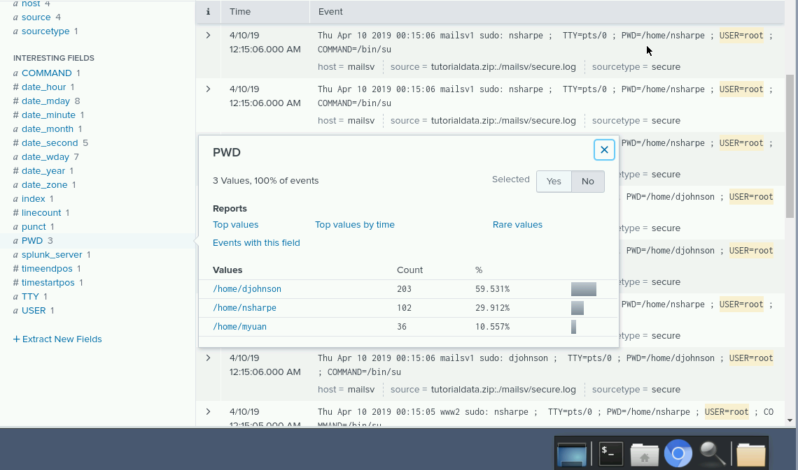
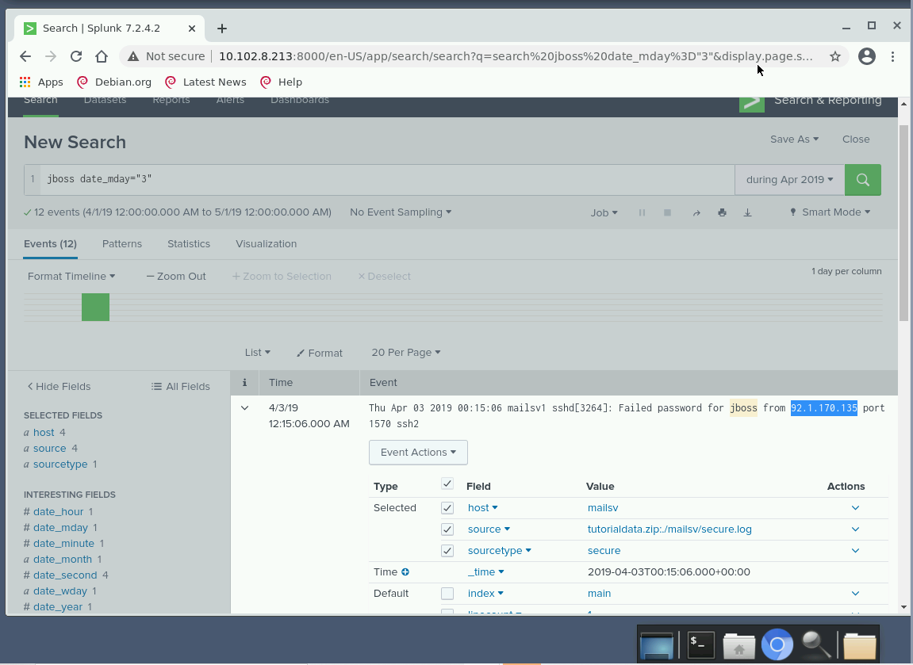
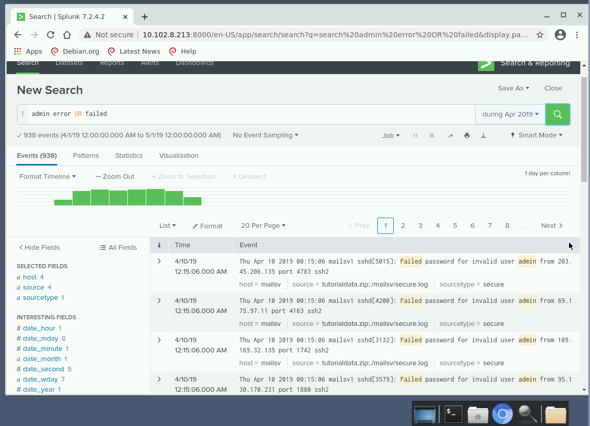

# Intro to Splunk

Splunk is an event collation and search tool often used for log analysis in SIEM environments. It harnesses machine data to record potential threats, system health, fraudulent activity and operational intelligence. In this lab you will learn how to navigate Splunk using its provided tutorial data.

## Lab
Tasks
1. Connect to Splunk using the shortcut on the desktop.
2. Select 'Search & Reporting' and follow the instructions.
3. Search and analyse the logs to answer the questions.

### Question 1 
What’s the full website link (from HTTP to .com) with the word ‘buttercup’ in it?
http://www.buttercupgames.com

### Question 2
User djohnson successfully opened an SSH session. What was the date and time (chronologically) of their first connection to the host 'mailsv'? (As it appears in the log)
4/3/19 12:15:06.000 AM

### Question 3
Other than djohnson, which users have accessed a root account? (Enter as user1, user2)
nsharpe, myuan

### Question 4
Select the filter 'date_mday' and select the value '3', and include the username jboss – what is the IP address shown for the first 'failed password' entry on page one of the results?
92.1.170.135

### Question 5
Using the example query in the 'searching for multiple keywords' section, what is the log source of the first entry of the results?
tutorialdata.zip:./mailsv/secure.log

