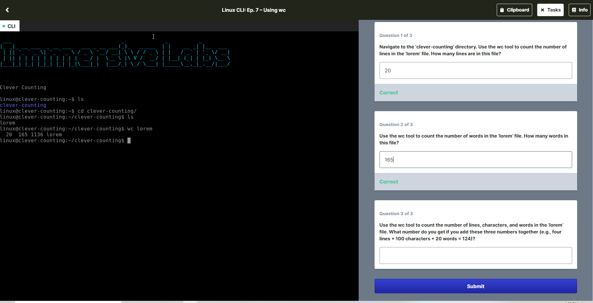

# Linux CLI: Ep. 7 – Using wc

Sometimes you just need to know how many words there are in a text file. Or how many lines of log errors there might be in a log file. Thankfully, there’s a command in the CLI for that. In this lab you will use the wc command to count within a file in the command line.

### Learning outcomes
Be able to count elements in a file using the wc tool

### What's involved
Use the wc command can to display a word count of files on the command line
Use the wc command to count words, characters, and lines in different files.

## Question 1 of 3
Navigate to the ‘clever-counting’ directory. Use the wc tool to count the number of lines in the ‘lorem’ file. How many lines are in this file?

**20**

## Question 2 of 3
Use the wc tool to count the number of words in the ‘lorem’ file. How many words in this file?

**165**

## Question 3 
Use the wc tool to count the number of lines, characters, and words in the ‘lorem’ file. What number do you get if you add these three numbers together (e.g., four lines + 100 characters + 20 words = 124)?

  20  165 1136 lorem

  20+165+1136 = 
  **1321**