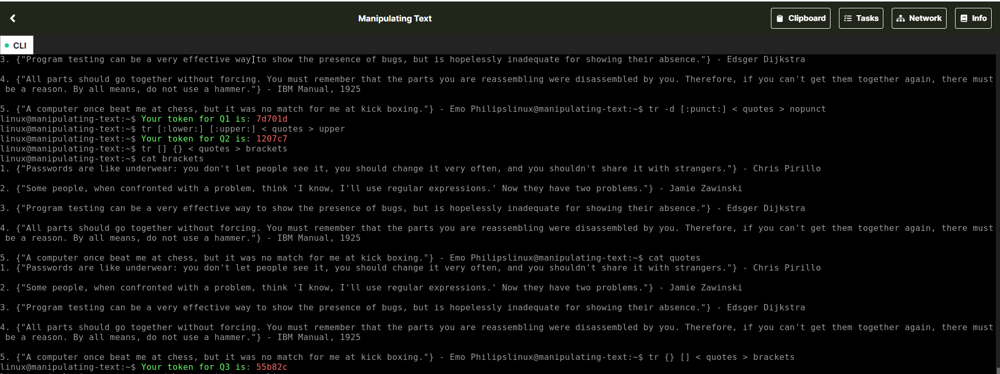
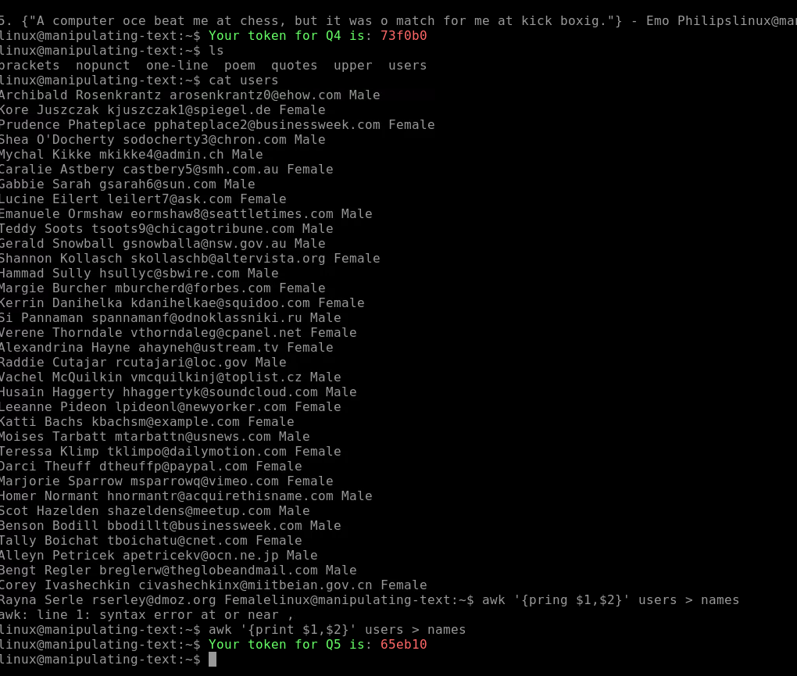
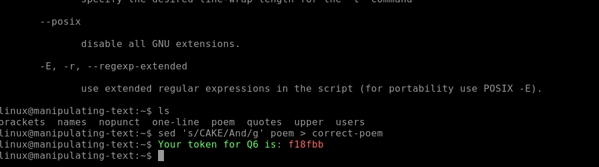

# Manipulating Text Lab

About:
https://immersivelabs.online/labs/manipulating-text/category/technical-fundamentals/series/linux-command-line

Manipulating Text
This lab introduces some of the ways you can modify the contents of a file using the Linux command line through text manipulation.

Learning Outcomes
Demonstrating the use of basic linux commands to manipulate files

What's Involved 
Use basic Linux commands to manipulate files in the command line

## Tasks

### Question 1 of 6
Using tr, remove the punctuation from the ‘quotes’ file and save the output to a new file called ‘nopunct’ in the same directory. Enter the token displayed.
tr -d [:punct:] < quotes > nopunct
7d701d

### Question 2 of 6
Using tr, convert lowercase characters in the ‘quotes’ file to uppercase, and save the output to a new file called ‘upper’ in the same directory. Enter the token displayed.
tr [:lower:] [:upper:] < quotes > upper

### Question 3 of 6
Using tr, replace the braces ‘{ }’ in the ‘quotes’ file with square brackets ‘[ ]’ and save the output to a new file called ‘brackets’ in the same directory. Enter the token displayed.
tr {} [] < quotes > brackets
 55b82c

### Question 4 of 6
Using tr, remove the newlines in the ‘quotes’ file so the text now appears on a single line. Save the output to a file called ‘one-line’. Enter the token displayed.
tr -d [:cntrl:] < quotes > one-line

### Question 5 of 6
Using awk, print out the 1st and 2nd fields from the 'users' file and save the output to a file called 'names'. Enter the token displayed.
awk '{print $1,$2}' users > names

### Question 6 of 6
Using sed, replace the word 'CAKE' with the correct word 'And' in the file 'poem'. Save the output to a file called 'correct-poem'. Enter the token displayed.
sed 's/CAKE/And/g' poem > correct-poem

Example sed pattern:
sed 's/PATTERN TO FIND/PATTERN TO REPLACE/g' input-file.txt > output-file.txt