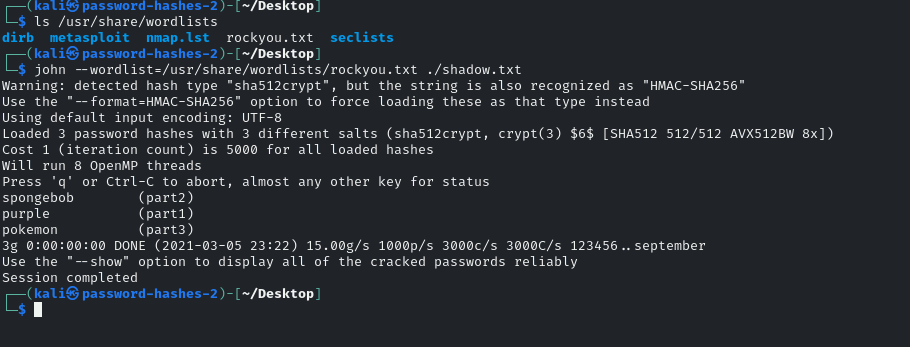

# Password Hashes II

Salting is an extra step during hashing that adds an additional value to the end of the password, thereby changing the hash value produced. Salting can drastically reduce the chances of an attacker cracking your passwords. In this lab, you will learn about the benefits of password salting, as well as attempt to crack salted hashes.

MITRE | ATT&CK Framework [Credential Dumping](https://attack.mitre.org/versions/v6/techniques/T1003/) 

## Lab

Tasks
1. Read through the information about salting hashes
2. Answer the questions to earn the badge and points

Shadow file:
part1:$6$WJ9Y7LHr$Tfbjp94zPKkvZtBE./bhLVaWuXK.Qn9WZzMmX6jlubL7pJ9t4CU.CZMoO..SrbiYOdzCD3Z9.ssA5gCEdXore1:1001:1001::/home/part1:/bin/bash
part2:$6$OiSz6xnZ$XPAdQmO01dGRcdNVpd5jJ2tzkSrUMqXTdYedYKgNWcMOA9ukr8pgJ61xNY1OOcmu3pTLKicnnC27mRa6vnrfJ0:1002:1002::/home/part2:/bin/bash
part3:$6$hv6ZhFAI$mYgadpdFqo8V0ylhdgE7.mZ5GaKM4Os1wZzu6ZOCnX9rR./JSNBUG/9felcRcTGTVlWLQ6X1OwW9Wpb9ifzus1:1003:1003::/home/part3:/bin/bash

using the command

```john --wordllist=/usr/share/wordlists/rockyou.txt ./shadow.txt```

I was able to find out the hashes for the passwords



### Question 1
What is the plaintext password of 'hash part 1' in the shadow file?
purple

### Question 2
What is the plaintext password of 'hash part 2' in the shadow file?
spongebob

### Question 3
What is the plaintext password of 'hash part 3' in the shadow file?
pokemon

### Question 4
True or false: Adding a salt to a password before hashing is less secure.

    True

x   False

### Question 5
True or false: Salts do not need to be memorised by humans.

x   True

    False