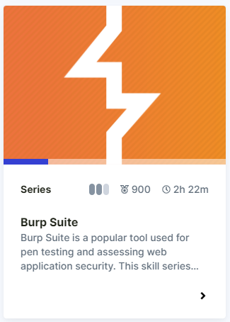

# Immersive Labs

* [About](#about)
* [Lab Write Ups](#Lab-Write-ups)
* [Snort](#snort)
* [Metapsploit](#metasploit)
* [Splunk](#splunk)
* [Passwords](#passwords)

## About

[Immersive Labs](https://www.immersivelabs.com/) is a gamified platform that allows you to try out challenges and earn points. 
I've completed quite a few of their challenges under the handle ItsET, at my University, WGU, I've earned 3rd position 

Below are my Write ups from some of the labs that I have completed.

## Lab Write ups 

- [Space After Filename](./SpaceAfterFilename.md)
- [National Software Reference Library (NSRL)](ImmersiveLabs\NationalSoftwareReferenceLibrary.md)

## XSL
[XSL Script Processing](./XSLScriptProcessing.md)

## Snort

[Snort](https://immersivelabs.online/browse/category/defensive/snort) is a free open-source network intrusion detection system. Developed and updated by Cisco, Snort has the ability to perform packet logging, protocol analysis, content searching, and pattern matching.

[Snort Rules: Ep. 1](./SnortRulesEp1.md)

[Snort Rules: Ep. 2 - DNS](./SnortRulesEp2.md)

[Snort Rules: Ep. 3 - HTTP](./SnortRulesEp2.md)

## Burp Suite

[Burp Suite](https://immersivelabs.online/browse/category/offensive/burp-suite)  is a popular tool used for pen testing and assessing web application security. This skill series will take you from the basics of configuring and using Burp Suite through to expertly traversing and applying its range of tools and features.

[Burp Suite Basics HTTP](./BurpSuiteBasicsHTTP.md)

## Metasploit

[Metasploit](https://immersivelabs.online/browse/category/infrastructure-hacking/metasploit?category=offensive)

[Msfvenom](./Msfvenom.md)

## Splunk

[Intro to Splunk](./IntroToSplunk.md) 

## Passwords

[Password Hashes II](./PasswordHashesII.md)
[Hydra: Brute Force](./HydraBruteForce.md)

WIP
Regex.md
HydraBruteForce.md