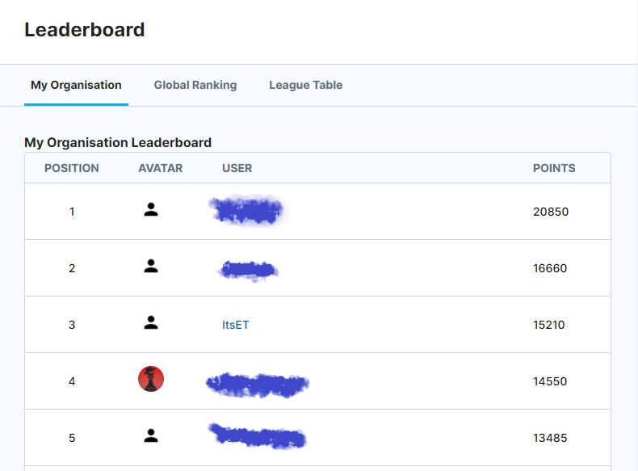
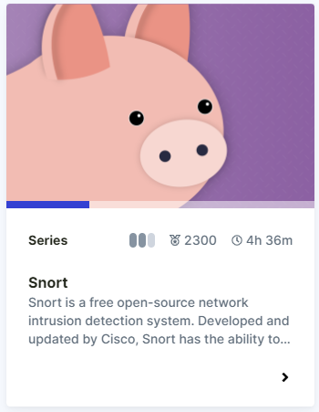
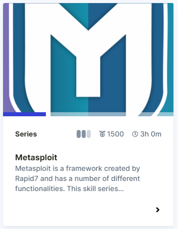

# Immersive Labs

* [About](#about)
* [Lab Write Ups](#Lab-Write-ups)
* [Snort](#snort)
* [Metapsploit](#metasploit)
* [Splunk](#splunk)

## About

[Immersive Labs](https://www.immersivelabs.com/) is a gamified platform that allows you to try out challenges and earn points. 
I've completed quite a few of their challenges under the handle ItsET, at my University, WGU, I've earned 3rd position 

Below are my Write ups from some of the labs that I have completed.

## Lab Write ups 

[Space After Filename](./SpaceAfterFilename.txt)
[National Software Reference Library (NSRL)](ImmersiveLabs\NationalSoftwareReferenceLibrary.txt)

## XSL
[XSL Script Processing](./XSLScriptProcessing.txt)

### Snort

[Snort](https://immersivelabs.online/browse/category/defensive/snort) is a free open-source network intrusion detection system. Developed and updated by Cisco, Snort has the ability to perform packet logging, protocol analysis, content searching, and pattern matching.

[Snort Rules: Ep. 1](./SnortRulesEp1.txt)

[Snort Rules: Ep. 2 - DNS](./SnortRulesEp2.txt)

[Snort Rules: Ep. 3 - HTTP](./SnortRulesEp2.txt)

## Metasploit

[Metasploit](https://immersivelabs.online/browse/category/infrastructure-hacking/metasploit?category=offensive)

[Msfvenom](./Msfvenom.txt)

## Splunk

