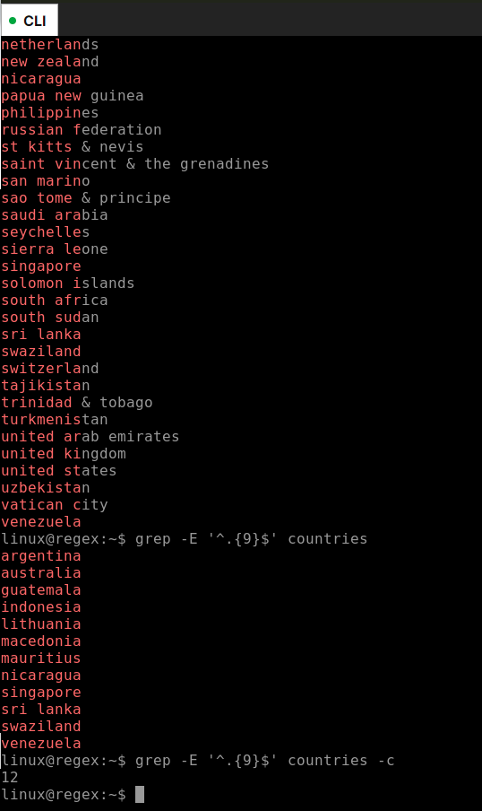

# Regex

## About

## Lab

Tasks
Understand how to create a regular expressions.
Analyse a regular expression and determine what strings will match the search pattern
Use regular expressions to search a file.

### Question 1
Which of the following would you use when trying to match any letters (regardless of case) in a string?

    [a-z]

    [abc]

    [a-Z]

x   [a-zA-Z]

### Question 2
Which of the following best describes the following regular expression: /\b\w{5}\b/g

x   Matches any word/text containing five letters

    Matches any word/text containing five or more letters

    Matches any word/text containing less than 5 characters

    Matches any word/text containing 5 characters or less.

### Question 3
Which of the following best describes the following regular expression: /([A-Z])\w*/g

    Matches any word/text containing letters.

    Matches any word/text excluding letters.

x   Matches any word/text starting with a capital letter.

    Matches any word/text excluding a capital letter.

### Question 4
Which of the following strings does not match the following regular expression: \b[www]+[a-zA-Z0-9.-]+\.[a-zA-Z]{2,}\b

    www.immersivelabs.co.uk

    www.1mmers1velabs.co.uk

    www.immersive-labs.co.uk

x   immersivelabs.co.uk

### Question 5
Search the ‘countries’ file for all the words containing exactly nine characters. How many results are found?
12

### Question 6
Search the ‘countries’ file for all the words with nine characters and the letter 'i'. How many results are found?

### Question 7
Search the ‘countries’ file for all the words containing nine characters and the letters 'i' and 'e'. How many results are found?

{WIP}
grep -E '(\w|\s){9}' regex.txt | grep -E 'i'
grep -E '(\w|\s){9}' regex.txt | grep -E 'i' | grep -E '\w+(\s\w+)*'

grep -E '^*+[i]+*.{9}' countries