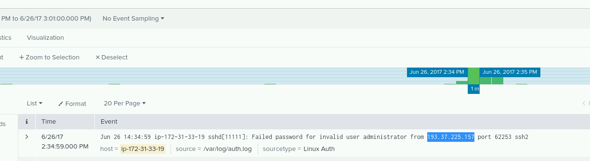

# Splunk: Event Analysis

https://immersivelabs.online/labs/event-analysis/

## Quick Summary
A core requirement for security analysis is examining security logs to identify and classify security attacks. In this lab you’ll be given access to an instance of Splunk, a popular event collation and search tool.

### Scenario
Using the Splunk service, you’ll need to identify and classify an attack following recent events that were recorded by the system.

Ensure you also include searching for free text, such as fail*, where all instances of the word ‘fail’ (e.g. failed and failure) will appear.

For more information on search parameters, take a look at the Splunk Search Commands site available here.
https://docs.splunk.com/Documentation/SplunkLight/6.6.1/References/Listofsearchcommands

## Lab:

Tasks
Use the shortcut on the desktop to access Splunk.
Search the events for information to answer the questions.

Question 1 
Which IP address is the attack coming from?
193.37.225.157

Question 2 
Which account beginning with the letter 'S' is the target of the attack?
superroot

Question 3
What protocol is being used in the attack?
ssh

Question 4 
Based on the information you have gathered, classify the attack.

    Spearphishing Campaign

    Denial of Service

x   Brute Force Password Guessing

    Forgotten password - not malicious attack

    SQL Injection