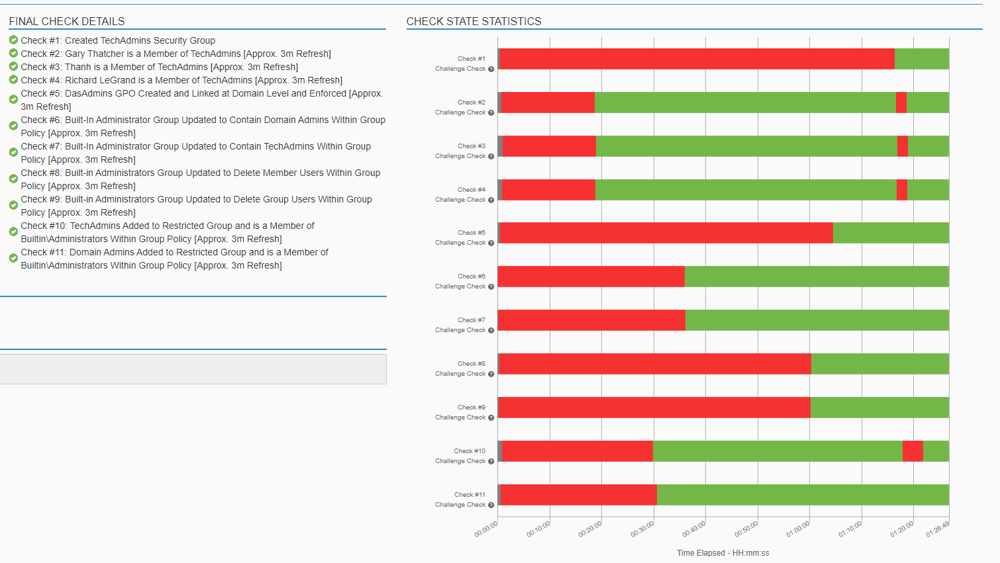

# Challenge 23 Local Admin No More, Security by Design

## Challenge Details
Challenge #T0045
Local Admin No More, Security by Design
Author: Jeff Echlin
Framework Category: Operate and Maintain
Specialty Area: Systems Analysis
Work Role: Systems Security Analyst
Task Description: Coordinate with systems architects and developers, as needed, to provide oversight in the development of design solutions.

### Scenario

Recently we have become aware of a security risk that our current windows workstations are vulnerable to. If an unauthorized user were to gain access to the system, there is not check or defense in place to guard against that attacker creating themselves a local administrator account to use later for backdoor access. This needs to be resolved. We need you to put in a manage safeguard to stop this from ever happening on our windows workstations.

---
## Steps taken to complete the required actions

Starting off, I have the following machines available for me to access and checks left to complete

I was given the following Network diagram map

Going into the Kali Security machine, I proceeded with the following steps

## USER SETUP

First, check if user exists
`less /etc/passwd`

Then let's add drandolph to the users

`sudo useradd -m drandolph`

Now I need to add the bash terminal as the users terminal.

`sudo usermod --shell /bin/bash drandolph`

And then I check to make sure that went through
`grep drandolph /etc/passwd`

Another option that I came across for for shell
`chsh -s /bin/bash drandolph`

Now to add drandolph to the list of sudoers

`sudo usermod -a -G sudo drandolph`

## NETWORKING

Next I need to make sure this machine is set up and connected to the network.

First I tried to change a file

`sudo nano /etc/resolvconf/resolv.conf.d/head`
This worked a little at first, but then I realized that it should be in 

`sudo nano /etc/resolv.conf`

domain daswebs.com
search ad.daswebs.com
nameserver 172.16.30.5
nameserver 8.8.8.8

Now I need to update the interfaces file

`nano /etc/network/interfaces`

address 172.16.30.6
netmask 255.255.255.0
gateway 172.16.30.2
network 172.16.30.5
broadcast 172.16.30.255

and added the networking there as well. To refresh I ran:

`ifup eth0`

I would like to check if I'm able to connect to the network, so I ping the Domain Controller

`ping 172.16.30.5`

Now to set the host name on the Kali box I ran:

`hostname SecConsultantKali`

## UPDATES ON THE DOMAIN CONTROLLER

On the domain controller, went to Server Manager > Roles > DNS Server > DNS > W2K8-AD-DHCP > Forward Lookup Zones > ad.daswebs.com 

In here I right clicked the white space to add a new A record for SecConsultantKali, I proceeded through the prompts and also checked to add a new PTR record.

Next I went up to Reverse Lookup Zones, for ad.daswebs.com added new PTR record
Host IP Address 172.16.30.6
SecConstultantKali.ad.daswebs.com

Once all of these steps were completed, I had finished my task, which I was able to verify by the green checkmarks next to the required tasks.

 

### NICE Framework KSA
A0055. Ability to operate common network tools (e.g., ping, traceroute, nslookup).
A0058. Ability to execute OS command line (e.g., ipconfig, netstat, dir, nbtstat).
A0059. Ability to operate the organization's LAN/WAN pathways.
K0011. Knowledge of capabilities and applications of network equipment including routers, switches, bridges, servers, transmission media, and related hardware.
K0029. Knowledge of organization's Local and Wide Area Network connections.
K0050. Knowledge of local area and wide area networking principles and concepts including bandwidth management.
K0061. Knowledge of how traffic flows across the network (e.g., Transmission Control Protocol [TCP] and Internet Protocol [IP], Open System Interconnection Model [OSI], Information Technology Infrastructure Library, current version [ITIL]).
K0076. Knowledge of server administration and systems engineering theories, concepts, and methods.
K0111. Knowledge of network tools (e.g., ping, traceroute, nslookup)
K0332. Knowledge of network protocols such as TCP/IP, Dynamic Host Configuration, Domain Name System (DNS), and directory services.
S0162. Skill in applying various subnet techniques (e.g., CIDR)
CAE Knowledge Units
Basic Networking
Network Technology and Protocols
Operating Systems Administration
