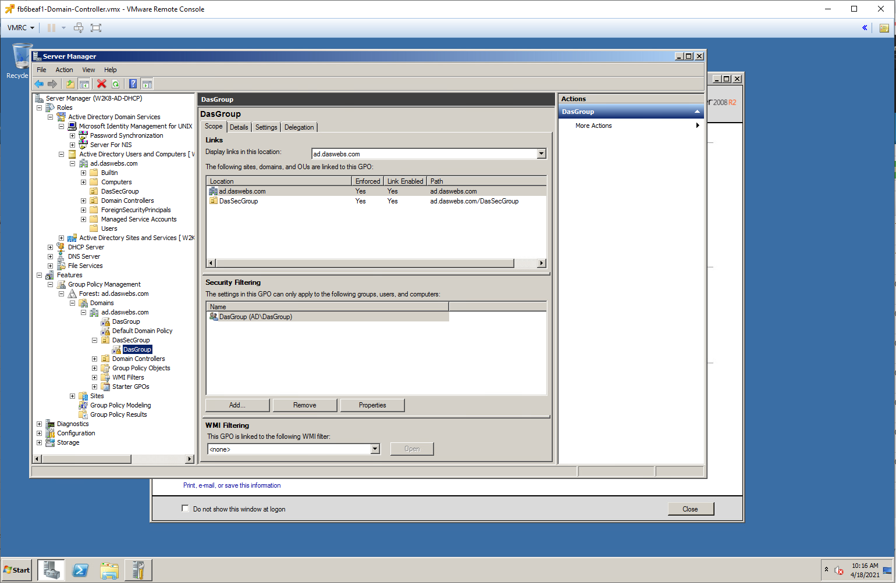
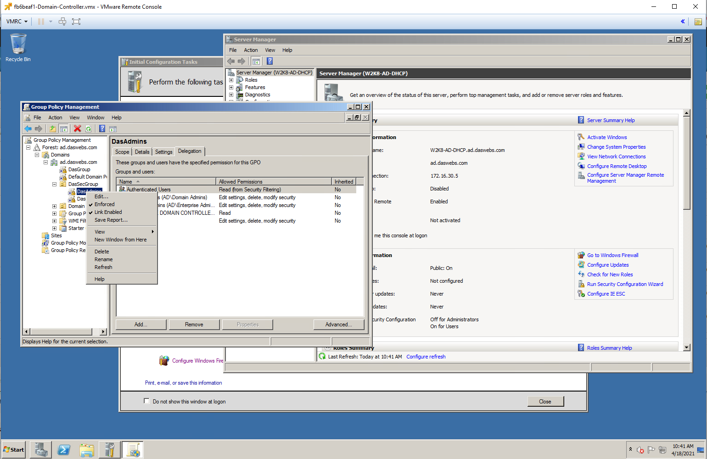
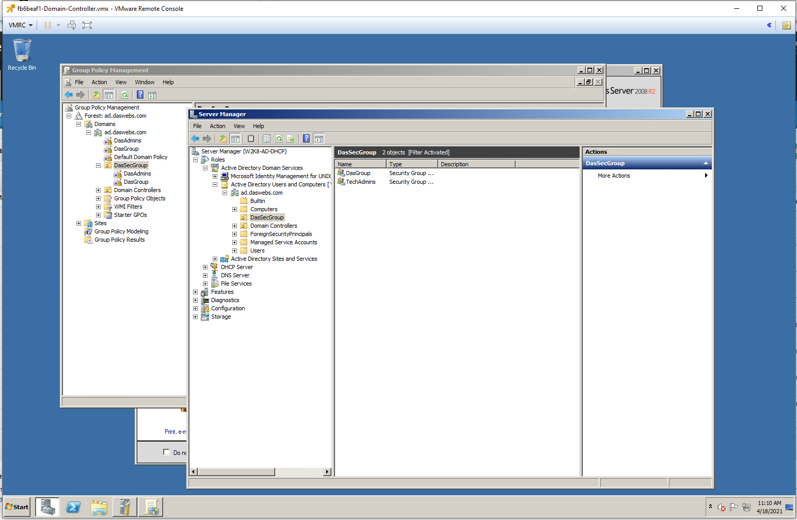
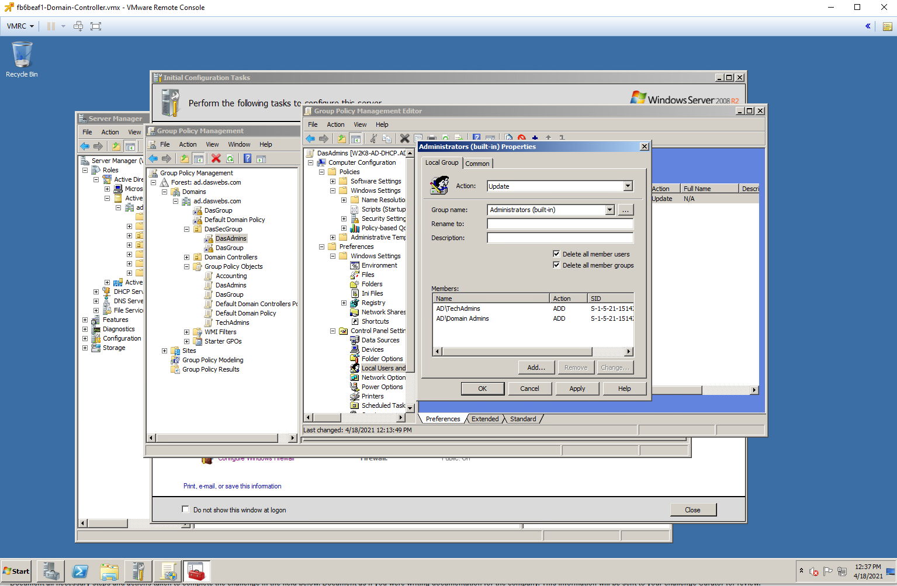
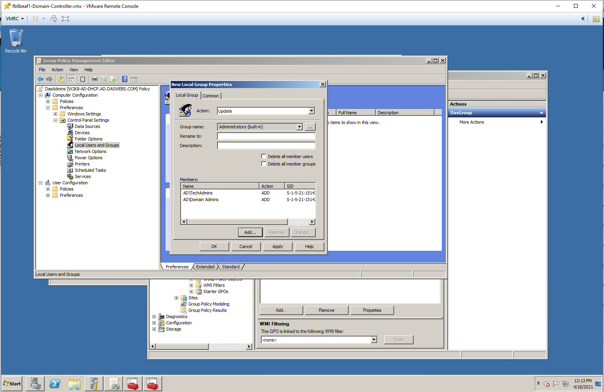
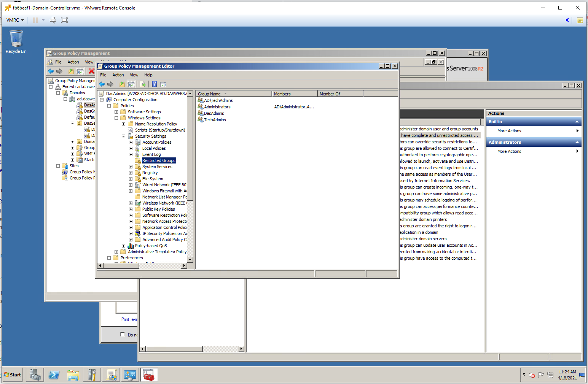
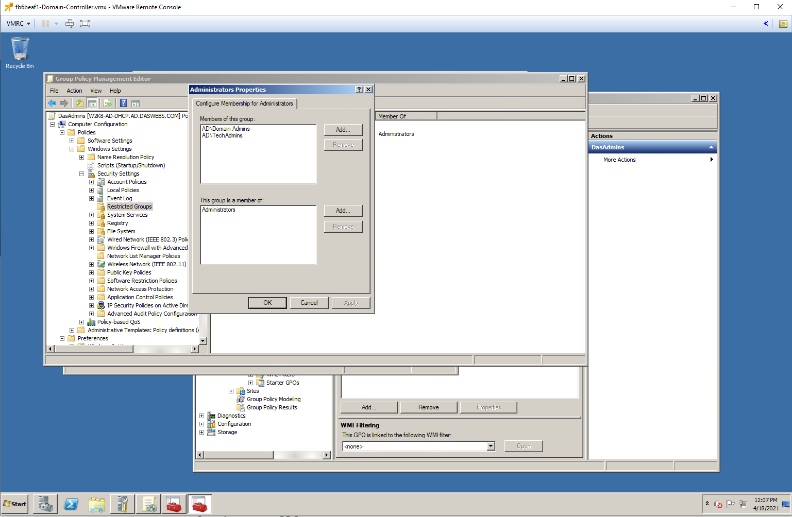
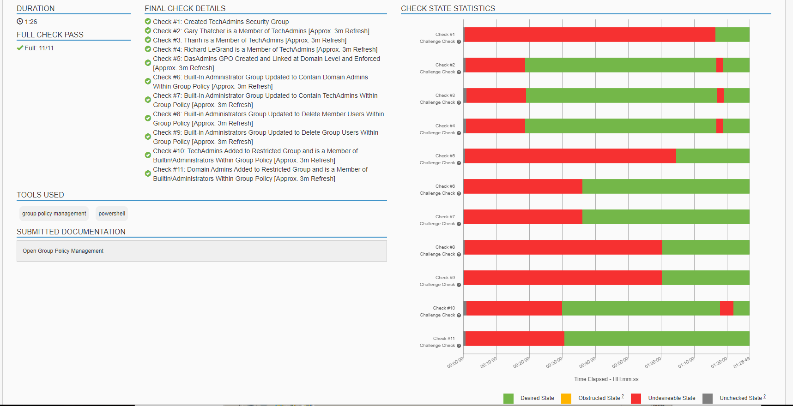

# Challenge 23 Local Admin No More, Security by Design

## Challenge Details
Challenge #T0045
Local Admin No More, Security by Design
Author: Jeff Echlin
Framework Category: Operate and Maintain
Specialty Area: Systems Analysis
Work Role: Systems Security Analyst
Task Description: Coordinate with systems architects and developers, as needed, to provide oversight in the development of design solutions.

### Scenario

Recently we have become aware of a security risk that our current windows workstations are vulnerable to. If an unauthorized user were to gain access to the system, there is not check or defense in place to guard against that attacker creating themselves a local administrator account to use later for backdoor access. This needs to be resolved. We need you to put in a manage safeguard to stop this from ever happening on our windows workstations.

---
## Steps taken to complete the required actions

Starting off, I have the following machines available for me to access and checks left to complete

TODO FILL OUT INFO HERE

I was given the following Network diagram map

## IMAGES
Start Writing Documentation to go with the screenshots you took

## NETWORKING

## UPDATES ON THE DOMAIN CONTROLLER

Once all of these steps were completed, I had finished my task, which I was able to verify by the green checkmarks next to the required tasks.

### NICE Framework KSA

### CAE Knowledge Units
