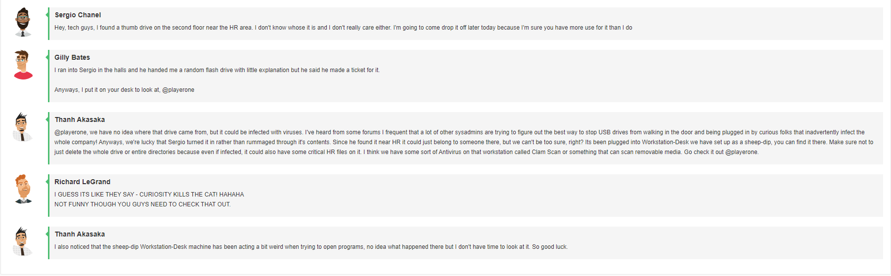
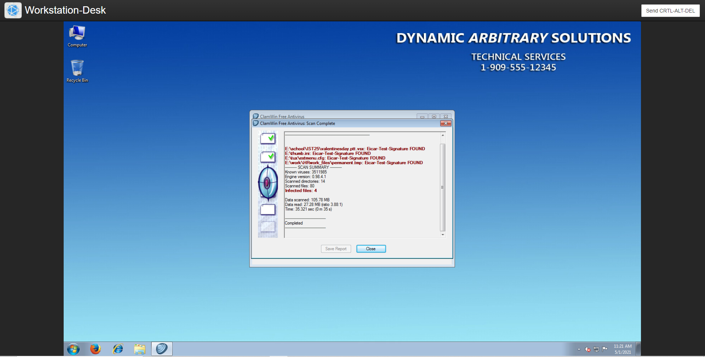
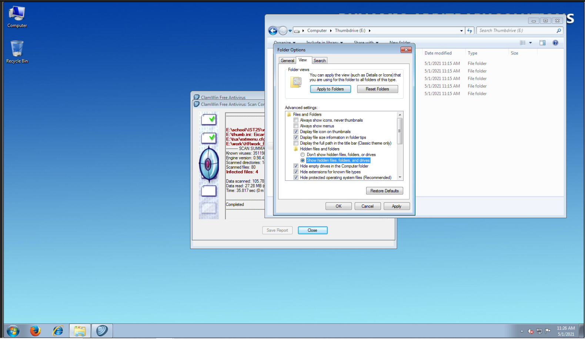
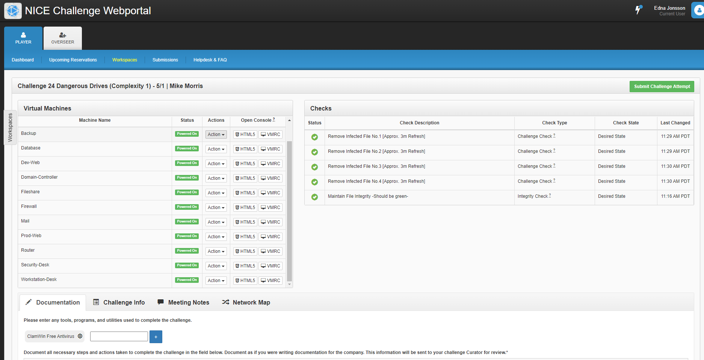

# Challenge 18 Linux Administration 201: 101 + Network Integration

## Challenge Details
Dangerous Drives
Author: Brendan Higgins
Framework Category: Investigate
Specialty Area: Digital Forensics
Work Role: Law Enforcement/CounterIntelligence Forensics
Task Description: Perform virus scanning on digital media. (T0285)

### Scenario

A USB thumb drive of unknown origin or owner has been found in the office. I need you to check and verify that the thumb drive does not contain any malicious software that could infect and damage the company's valuable data.

Additional Information
More details and objectives about this challenge will be introduced during the challenge meeting, which will start once you begin deploying the challenge.

You will be able to check your progress during this challenge using the check panel within the workspace once the challenge is deployed. The checks within the check panel report on the state of some or all of the required tasks within the challenge.

Once you have completed the requested tasks, you will need to document the methodology you used with as much detail and professionalism as necessary. This should be done on the documentation tab within the workspace once the challenge is deployed. Below the main documentation section be sure to include a tagged list of applications you used to complete the challenge.

Your username/password to access all virtual machines and services within the workspace will be the following...
Username: playerone
Password: password123

---
## Steps taken to complete the required actions

Open the Workstation-Desktop

Go to the start menu, select programs and files, right click on the ClamWin Free Antivirus, then Select "Run as Administrator"

Inside of the Antivirus program, Select Drive E, then click the button underneath that says "Scan". This will take a few minutes.

At end of scan, you will see the 4 files listed below were flagged as viruses. Then open the File Explorer, so that you can delete the 4 files listed in the Virus scan

Infected files:
- E:\school\IST25\valentinesday.ptt.vsx
- E:\thumb.ini
- E:\tux\extmennu.cfg
- E:\work\HRwork_files\permanent.tmp

Then start deleting the files.

In order to be able to delete the thumb.ini you have to enable show hidden files. In File explorer click on the "Organize" drop down, then select "Folder Options". Select the View tab. Go to the section under Advanced Settings, see where it says "Hidden files and folders", change the radio button to "Show hidden files, folders and drives"

That should take care of all the files that are infected with viruses and the rest of the files should still be on the drive.

