# Challenge 25 Insider Threat: Domain Lockdown Incoming 

## Author
    Edna J.
    WGU NICE Challenge
    DAS Web, Inc.
    May 16, 2021

## Challenge Details
Author: Jeff Echlin
Framework Category: Operate and Maintain
Specialty Area: Systems Analysis
Work Role: Systems Security Analyst
Task Description: Apply security policies to meet security objectives of the system.

### Scenario

The executive team here at DASWebs have recently been briefed on a growing issue popularly known as the "Insider Threat". After a quick meeting with the policy team we have defined some basic policies to reduce our attack surface to some degree. We are tasking you with bringing the corporate domain-controlled systems inline with the new company wide security policy. Within this policy, lies provisions for restricting the ability of employees to introduce or retrieve information from company systems through the use of external media. The policy also disables the ability for users to map/remove network drives and have immediate access to the Run utility.

-----
## Meeting Briefing

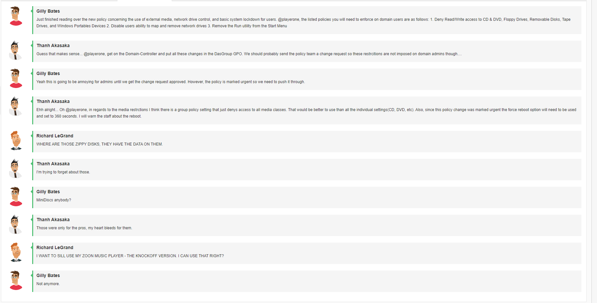

`Gilly Bates @gbates`
Just finished reading over the new policy concerning the use of external media, network drive control, and basic system lockdown for users. @playerone, the listed policies you will need to enforce on domain users are as follows: 1. Deny Read/Write access to CD & DVD, Floppy Drives, Removable Disks, Tape Drives, and Windows Portables Devices 2. Disable users ability to map and remove network drives 3. Remove the Run utility from the Start Menu

`Thanh Akasaka @takasaka`
Guess that makes sense... @playerone, get on the Domain-Controller and put all these changes in the DasGroup GPO. We should probably send the policy team a change request so these restrcitions are not imposed on domain admins though....

`Gilly Bates @gbates`
Yeah this is going to be annoying for admins until we get the change request approved. However, the policy is marked urgent so we need to push it through.

`Thanh Akasaka @takasaka`
Ehh alright... Oh @playerone, in regards to the media restrctions I think there is a group policy setting that just denys access to all media classes. That would be better to use than all the individual settings(CD, DVD, etc). Also, since this policy change was marked urgent the force reboot option will need to be used and set to 360 seconds. I will warn the staff about the reboot.

`Richard LeGrand @rlegrand`
WHERE ARE THOSE ZIPPY DISKS, THEY HAVE THE DATA ON THEM.

`Thanh Akasaka @takasaka`
I'm trying to forget about those.

`Gilly Bates @gbates`
MiniDiscs anybody?

`Thanh Akasaka @takasaka`
Those were only for the pros, my heart bleeds for them.

`Richard LeGrand @rlegrand`
I WANT TO SILL USE MY ZOON MUSIC PLAYER - THE KNOCKOFF VERSION. I CAN USE THAT RIGHT?

`Gilly Bates @gbates`
Not anymore.

---
## Steps taken to complete the required actions

Starting off, I have the following machines available for me to access and checks left to complete

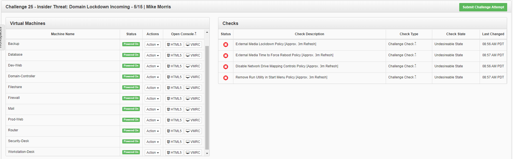

I was given the following Network diagram map

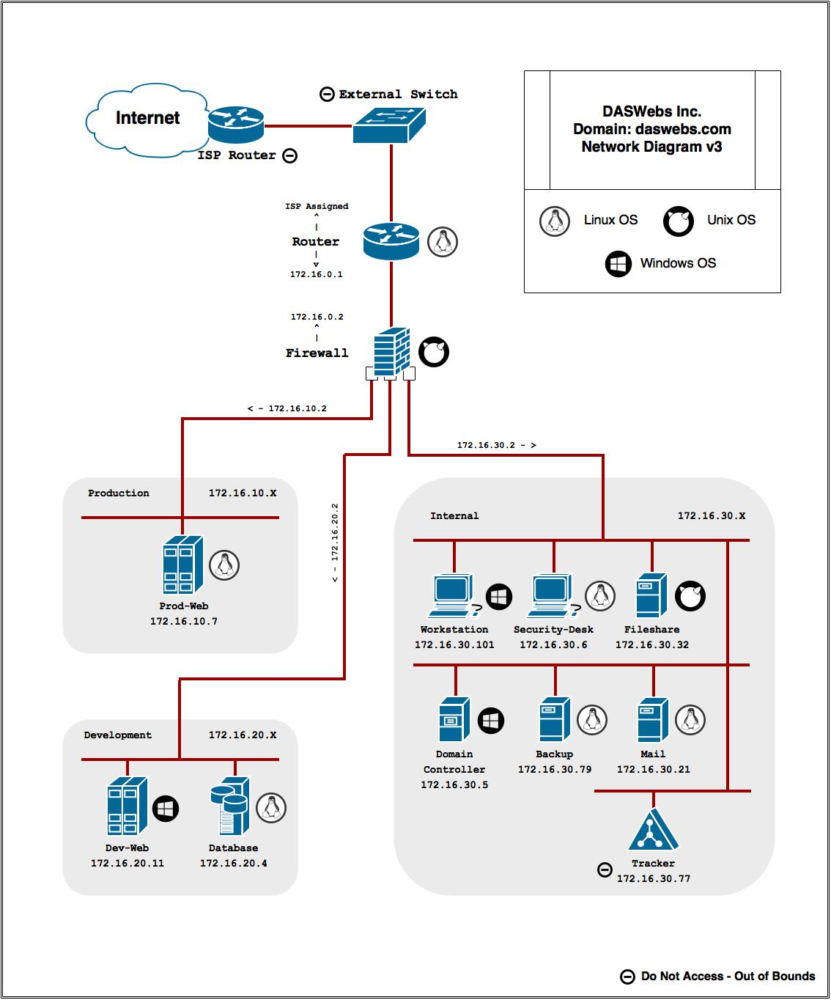

#### The tasks that I was working on completing were
 - External Media Lockdown Policy
 - External Media Time to Force Reboot Policy
 - Disable Network Drive Mapping Controls Policy
 - Remove Run Utility in Start Menu Policy

### For the first task "External Media Lockdown Policy"
I went to the Group Policy Managment Editor. 
Policies > Administrative Templates: Policy Definitions > Systems > Removable Storage Access.

Then I right clicked on All Removable Storage Classes: Deny all access.
On the radio button, I selected "Enabled", clicked Apply, then OK.

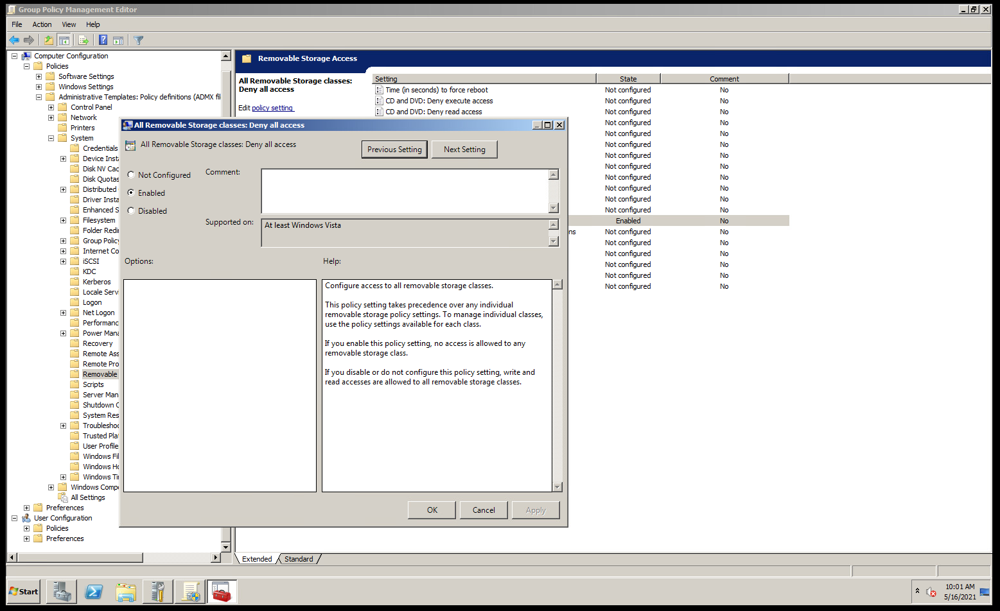

### For the second task "External Media Time to Force Reboot Policy"
Staying on the same window in the Group Policy Management Editor.
The top item "Time (in seconds) to force reboot, I right clicked on it. Then selected "Enabled" from the radio button, then under options, using the arrow, edited the "Time (in seconds)" to 360. Clicked Apply, then ok.

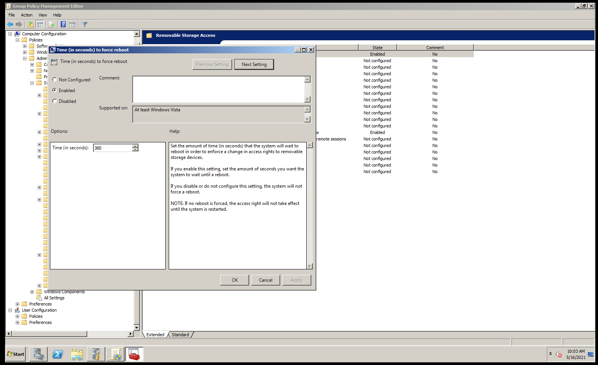

Once those settings are completed, the Removable Storage Access in Group Policy will look like this:

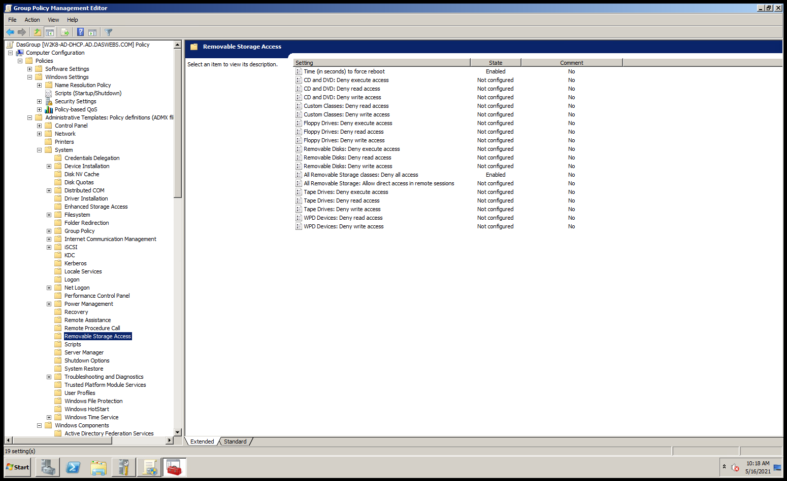

### For the third task "Disable Network Drive Mapping Controls Policy"
I went to the Group Policy Managment Editor. 
Policies > Administrative Templates: Policy Definitions > Windows Explorer > Remove "Map Network Drive" and "Disconnect Network Drive"

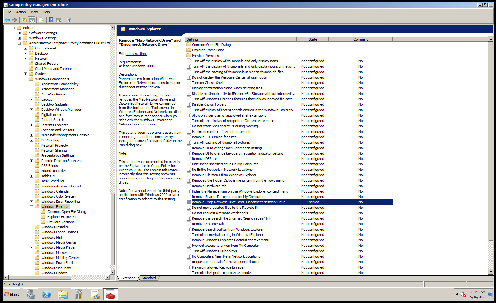

Then I right clicked on Remove "Map Network Drive" and "Disconnect Network Drive".
On the radio button, I selected "Enabled", clicked Apply, then OK. This Disabled the Network Drive Mapping.

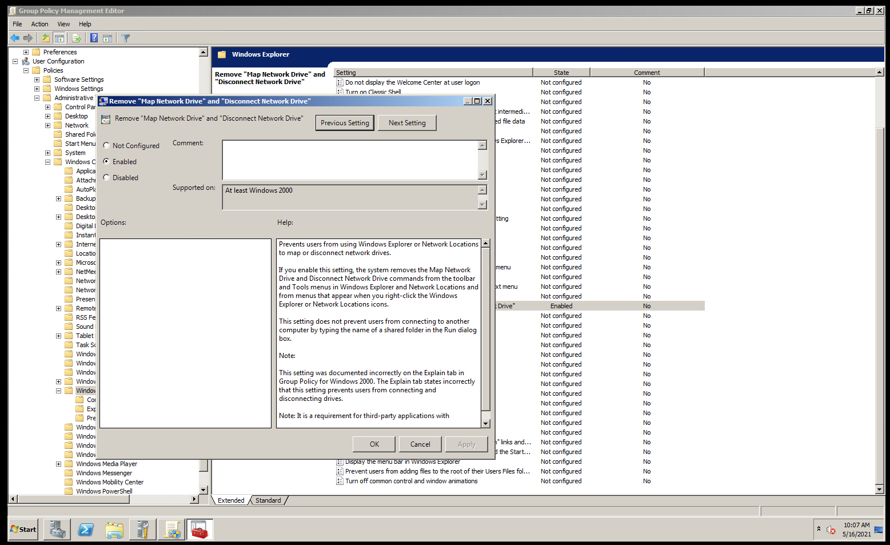

### For the fourth task "Remove Run Utility in Start Menu Policy"
I went to the Group Policy Managment Editor. 
Policies > User Configuration > Policies > Start Menu and Taskbar > Remove Run menu from Start Menu

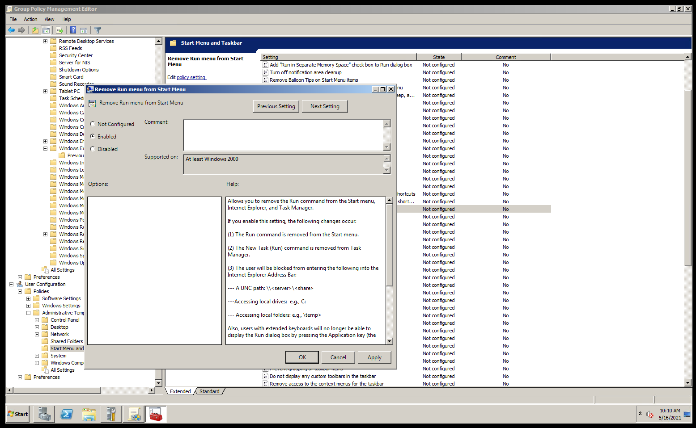

Then I right clicked on Remove Run menu from Start Menu.
On the radio button, I selected "Enabled", clicked Apply, then OK. This removes the Run menu and the Run utility.

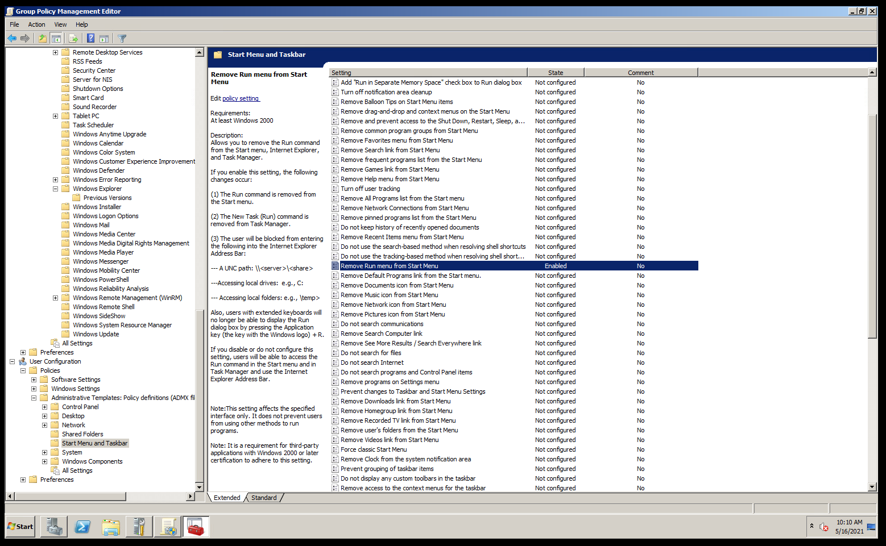

Once all of these steps were completed, I had finished my task, which I was able to verify by the green checkmarks next to the required tasks.

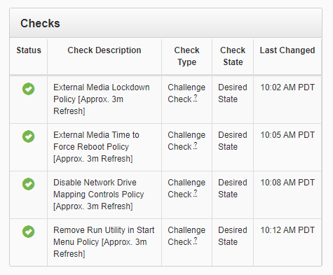 

### NICE Framework KSA
K0002. Knowledge of risk management processes (e.g., methods for assessing and mitigating risk).
K0004. Knowledge of cybersecurity and privacy principles.
K0005. Knowledge of cyber threats and vulnerabilities.
K0036. Knowledge of human-computer interaction principles.
K0044. Knowledge of cybersecurity and privacy principles and organizational requirements (relevant to confidentiality, integrity, availability, authentication, non-repudiation).
K0056. Knowledge of network access, identity, and access management (e.g., public key infrastructure, Oauth, OpenID, SAML, SPML).
K0060. Knowledge of operating systems.
K0263. Knowledge of information technology (IT) risk management policies, requirements, and procedures.
K0276. Knowledge of security management.
K0297. Knowledge of countermeasure design for identified security risks.

### CAE Knowledge Units
Cybersecurity Foundations
IT Systems Components
Operating Systems Concepts
Operating Systems Hardening
Windows System Administration
