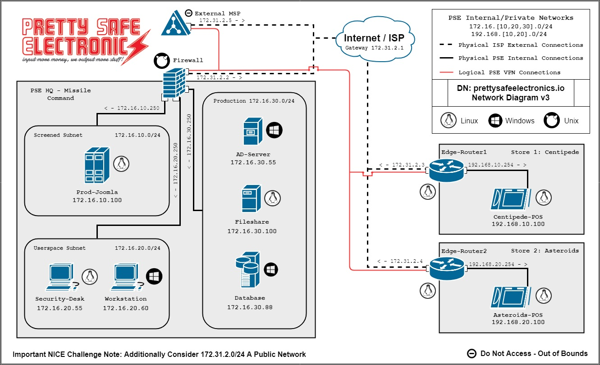
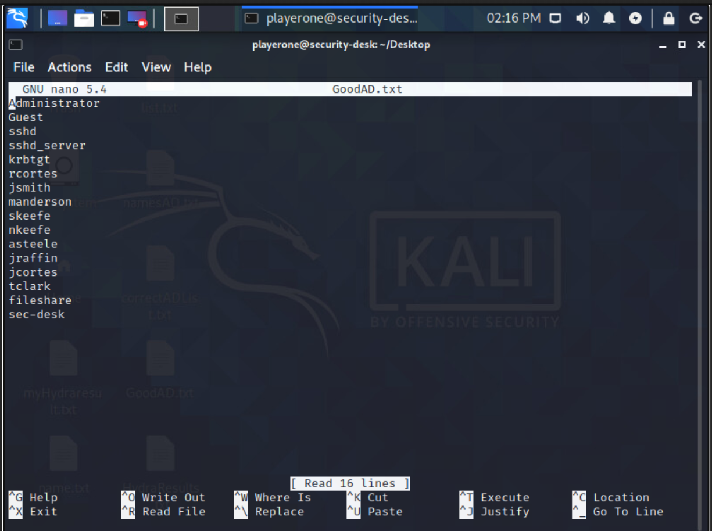

# Challenge 26  Penetration Testing: Bringing Passwords Up To Snuff

## Author
Edna J.
WGU NICE Challenge
DAS Web, Inc.
May 30, 2021

## Challenge Details
Author: Bailey Kasin
Framework Category: Protect and Defend
Specialty Area: Vulnerability Assessment and Management
Work Role: Vulnerability Assessment Analyst
Task Description: Conduct and/or support authorized penetration testing on enterprise network assets. (T0028)

### Scenario

We have reason to believe that some of our employees have weaker than should be acceptable passwords, so we want you to conduct authorized penetration testing against various company assets to determine which employees need to change their passwords.

-----
## Meeting Briefing

`Ricardo Cortes @rcortes`
This might be pretty bad, I was reading an article online today and it talked about how businesses are being hacked more frequently because of weak passwords. How sure are we that this won't happen to us?

`Ashley Steele @asteele`
I know for sure that my password is strong, but I don't know about anyone else's.

`Shawn O’Keefe @skeefe`
I'm in the same boat as Ashley. Perhaps @playerone could take this opportunity to get some penetration testing experience.

`Ashley Steele @asteele`
That's actually a great idea. Try performing a dictionary brute force attack on our Active Directory users. Perform a dictionary attack on all user logins except your own. Metasploit, Hydra, or Nmap probably have tools for something like this. Remember, you're a Domain Admin. So, if you get into an account, log in to Domain-Controller and set that user's account to require a password reset on next login.

`Ricardo Cortes @rcortes`
I'll send out a notice saying that anyone who sees the reset screen needs to set their password to something more complex.

`Ashley Steele @asteele`
Good call, @rcortes.

`Shawn O’Keefe @skeefe`
@asteele, do you have a recommended wordlist that playerone should use for the dictionary attack?

`Ashley Steele @asteele`
Kali comes with a good password list. You should be able to find it in /usr/share/wordlists on Security-Desk. I think it's called rockyou, or something like that.

`Ricardo Cortes @rcortes`
@playerone, that is the wordlist I want you to use. Be sure to only request password resets from accounts that you were able to brute force with that wordlist. There's no need to force users to change their passwords if they're already pretty secure.

---
## Tools used

- scp
- tr
- hydra
- SMB
- Powershell
- Bash
- Active Director
- AD Server Manager
- LDAP

## Steps taken to complete the required actions

Starting off, I have the following machines available for me to access and checks left to complete

I was given the following Network diagram map

#### The tasks that I was working on completing were
 - AD Accounts That Do Not Need a Password Reset Are Not Marked for One 
 - AD Accounts That Do Need a Password Reset Are Marked for One

### For the first task "AD Accounts That Do Need a Password Reset Are Marked for One"

My first mission was to find out who the users are that exist on the Domain Controller

To create the list of AD Users on the Domain Controller. I referenced the Microsoft Documentation for the [GET-ADUser](https://docs.microsoft.com/en-us/powershell/module/activedirectory/get-aduser?view=windowsserver2019-ps)

Moved to the Security-Desk, I used SCP to copy that list of users to the Security Desk.

Once I had a list of users, I cleaned that list up with the Translate command and using nano to remove extraneous users and spaces.

With this list, I used Hydra to brute-force the user's credentials. I tried SMB, it didn't work, so I went to LDAP2, then went back to SMB and that's when it ended up working.

The following were the commands that helped me solve this challenge

`scp playerone@172.16.30.55:C:/Users/playerone/name.txt list.txt`

`cat lists.txt`

`cat lists.txt | awk -F "," '{ print $10 }' > correctADList.txt`

`tr -d '"' < correctADList.txt > GoodAD.txt`

`nano GoodAD.txt`

`hydra man`

I tried running Hydra on LDAP 2, which resulted in a fun list of passwords, but didn't give me any users.

`hydra -L ./GoodAD.txt -P /usr/share/worldlists/rockyou.txt -o HydraResults.txt -v 172.16.30.55 smb`

`cat HydraResults.txt`

After I discovered that the users who needed to have their passwords updated, which were users `jcortes` and `nkeefe`, I went back to the Domain Controller machine and viewed the Active Directory information for Users

I made sure to uncheck "Password never expires"

Next I checked the box "User must change password at next login"

I updated this for nkeefe and jcortes.

Once all of these steps were completed, I had finished my task, which I was able to verify by the green checkmarks next to the required tasks.

 

### NICE Framework KSA
A0123. Ability to apply cybersecurity and privacy principles to organizational requirements (relevant to confidentiality, integrity, availability, authentication, non-repudiation).
K0002. Knowledge of risk management processes (e.g., methods for assessing and mitigating risk).
K0003. Knowledge of laws, regulations, policies, and ethics as they relate to cybersecurity and privacy.
K0004. Knowledge of cybersecurity and privacy principles.
K0005. Knowledge of cyber threats and vulnerabilities.
K0009. Knowledge of application vulnerabilities.
K0044. Knowledge of cybersecurity and privacy principles and organizational requirements (relevant to confidentiality, integrity, availability, authentication, non-repudiation).
K0167. Knowledge of system administration, network, and operating system hardening techniques.
K0206. Knowledge of ethical hacking principles and techniques.
K0342. Knowledge of penetration testing principles, tools, and techniques.
S0044. Skill in mimicking threat behaviors.
S0051. Skill in the use of penetration testing tools and techniques.

### CAE Knowledge Units
Cybersecurity Ethics
Cybersecurity Foundations
Cybersecurity Planning and Management
Cybersecurity Principles
Cyber Threats
Penetration Testing
Policy, Legal, Ethics, and Compliance
Privacy
Web Application Security

## References:

https://docs.microsoft.com/en-us/powershell/module/activedirectory/get-aduser?view=windowsserver2019-ps

https://docs.rapid7.com/metasploit/discovery-scan

https://tools.kali.org/password-attacks/hydra

https://gitlab.com/kalilinux/packages/hydra

https://github.com/frizb/Hydra-Cheatsheet