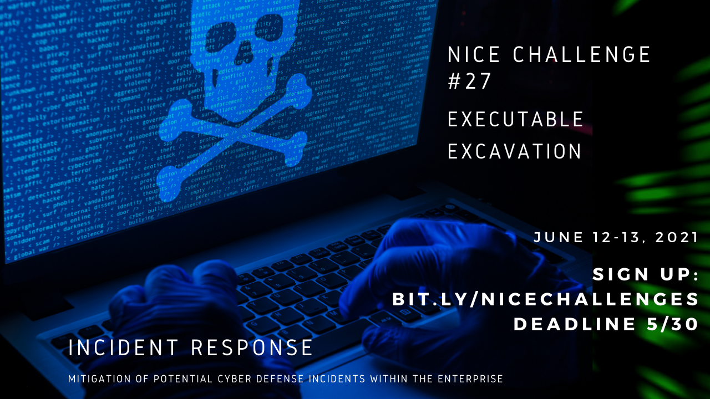

# Challenge 27 Executable Excavation

## Author
    Edna J.
    WGU NICE Challenge
    Pretty Safe Electronics
    June 13, 2021

## Challenge Details

**Author:** Bailey Kasin
**Framework Category:** Protect and Defend
**Specialty Area:** Incident Response
**Work Role:** Cyber Defense Incident Responder
**Task Description:** Collect intrusion artifacts (e.g., source code, malware, Trojans) and use discovered data to enable mitigation of potential cyber defense incidents within the enterprise. (T0278)
### Scenario
Shawn O'Keefe had a strange executable that was found on his workstation. It has been isolated on Security Desktop, but we want you take a look at it to see if you can determine what it was doing.

-----
## Meeting Briefing

I didn't capture the meeting information this time. Essentially a user had malware that was detected on their workstation and it has been isolated on the security desk. They wanted us to analyze the malware and find out what IP address it was calling out to, then fill out the Incident Response Form.

---
## Tools used

 - Joe Sandbox Cloud
 - Powershell
 - Bash
 - .Net Reflector

## Steps taken to complete the required actions

I was given the following Network diagram map

I started off by running the malware on Joe Sandbox to see if I could find any information there. I was unable to get much other than the IP address. There were no pcap files there. 

Then I tried to see what was in the expoit, so I just used Cat to check.

I tried to run the program in the sandbox machine and listen to it with wireshark and looking at the pcaps, I was not able to find any packets travelling to the IP address listed in the malware. So I figured out that I needed to do static analysis on this malware.

I found a program called .Net Reflector and found the following.
This shows the TimeSpanFromMinutes variable.

This one shows the IP address.

Finally, the Incident Response submission had the following information

- Activity Type: Data Exfiltration
- Malicious IP Address: 172.31.2.29
- Malicious Port: 21
- Interval Payload Ran On: 7

### NICE Framework KSA
    K0001. Knowledge of computer networking concepts and protocols, and network security methodologies.
    K0002. Knowledge of risk management processes (e.g., methods for assessing and mitigating risk).
    K0004. Knowledge of cybersecurity and privacy principles.
    K0005. Knowledge of cyber threats and vulnerabilities.
    K0041. Knowledge of incident categories, incident responses, and timelines for responses.
    K0042. Knowledge of incident response and handling methodologies.
    K0070. Knowledge of system and application security threats and vulnerabilities (e.g., buffer overflow, mobile code, cross-site scripting, Procedural Language/Structured Query Language [PL/SQL] and injections, race conditions, covert channel, replay, return-oriented attacks, malicious code).
    K0161. Knowledge of different classes of attacks (e.g., passive, active, insider, close-in, distribution attacks).
    K0162. Knowledge of cyber attackers (e.g., script kiddies, insider threat, non-nation state sponsored, and nation sponsored).
    K0179. Knowledge of network security architecture concepts including topology, protocols, components, and principles (e.g., application of defense-in-depth).
    K0259. Knowledge of malware analysis concepts and methodologies.
    K0287. Knowledge of an organization's information classification program and procedures for information compromise.
    S0003. Skill of identifying, capturing, containing, and reporting malware.
    S0078. Skill in recognizing and categorizing types of vulnerabilities and associated attacks.
    S0080. Skill in performing damage assessments.

### CAE Knowledge Units
    Basic Cyber Operations
    Basic Networking
    Basic Scripting and Programming
    Cyber Crime
    Cybersecurity Foundations
    Cyber Threats
    Digital Forensics
    Security Risk Analysis
    Software Reverse Engineering
    Software Security Analysis

