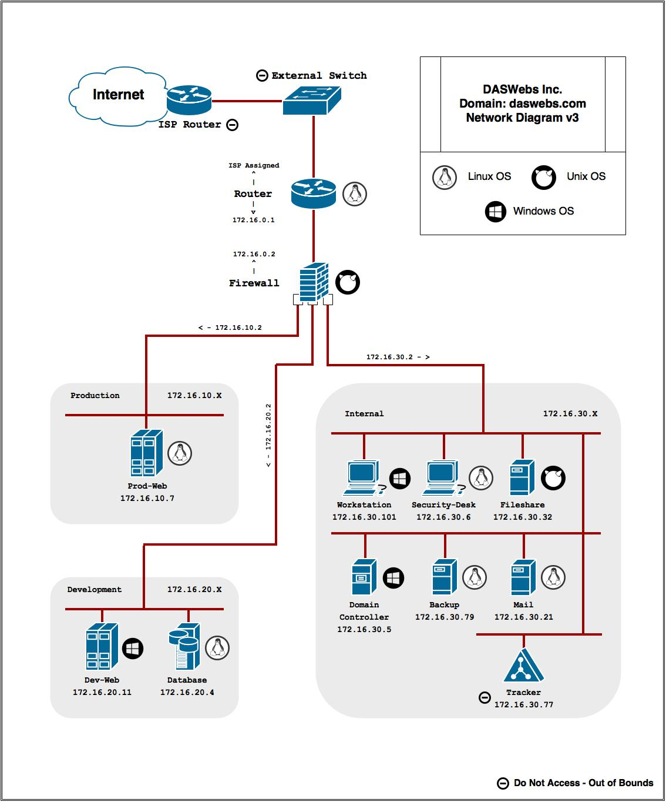

# Challenge 28 Digital Duplicates

## Author
Edna J.
WGU NICE Challenge
DASWebs Inc.
June 27, 2021

## Challenge Details

### Scenario
Recently Gary Thatcher our senior system administrator, came across a thumb drive attached to an employee's system. According to the employee, the thumb drive was attached without their consent and they are unsure of the origin of said drive. The drive was passed to Ione Leventis one of our security analysts. Ione has attached the drive to our sheep-dip system which in our case is the Security-Desk machine. However, Ione was called away on other matters and you are now entrusted with the task. According to current company policy the thumb drive must be inspected for any malicious agents that could threaten DAS Web's overall security. Your job is to create a forensically sound duplicate image of the thumb drive using dcfldd so it can be examined without the risk of inadvertently modifying potential evidence. SHA512 hashes should also be taken and compared between the original thumb drive which is already attached, but not mounted, to the system and the forensic image.

-----
## Meeting Briefing

---
## Tools used

 - List item 1
 - List item 2
 - List item 3

## Steps taken to complete the required actions

Starting off, I have the following machines available for me to access and checks left to complete

I was given the following Network diagram map

#### The tasks that I was working on completing were
 - List item 1
 - List item 2
 - List item 3

### Task 1 Heading

### Task 2 Heading

(Get this info before deploying challenge or after)
### NICE Framework KSA
    K0017. Knowledge of concepts and practices of processing digital forensic data.
    K0021. Knowledge of data backup and recovery.
    K0042. Knowledge of incident response and handling methodologies.
    K0060. Knowledge of operating systems.
    K0117. Knowledge of file system implementations (e.g., New Technology File System [NTFS], File Allocation Table [FAT], File Extension [EXT]).
    K0118. Knowledge of processes for seizing and preserving digital evidence.
    K0122. Knowledge of investigative implications of hardware, Operating Systems, and network technologies.
    K0132. Knowledge of which system files (e.g., log files, registry files, configuration files) contain relevant information and where to find those system files.
    K0133. Knowledge of types of digital forensics data and how to recognize them.
    K0304. Knowledge of concepts and practices of processing digital forensic data.
    S0047. Skill in preserving evidence integrity according to standard operating procedures or national standards.
    S0065. Skill in identifying and extracting data of forensic interest in diverse media (i.e., media forensics).
    S0067. Skill in identifying, modifying, and manipulating applicable system components within Windows, Unix, or Linux (e.g., passwords, user accounts, files).
    S0073. Skill in using virtual machines. (e.g., Microsoft Hyper-V, VMWare vSphere, Citrix XenDesktop/Server, Amazon Elastic Compute Cloud, etc.).
    S0089. Skill in one-way hash functions (e.g., Secure Hash Algorithm [SHA], Message Digest Algorithm [MD5]).

### CAE Knowledge Units
    Cybersecurity Principles
    Digital Forensics
    IT Systems Components
    Operating Systems Concepts

### NICE Framework 1.0 Mapping (August 2012 - August 2017)
480 - Create a forensically sound duplicate of the evidence (i.e., forensic image) that ensures the original evidence is not unintentionally modified, to use for data recovery and analysis processes. This includes, but is not limited to, hard drives, floppy diskettes, compact discs (CD3), personal digital assistants (PDAS), mobile phones, global positioning satellite devices (GPSS), and all tape formats

#### NICE Framework 1.0 KSA
217. Skill in preserving evidence integrity according to standard operating procedures or national standards
24. Knowledge of basic concepts and practices of processing digital forensic data
287. Knowledge of file system implementations (e.g., New Technology File System [NTFS], File Allocation Table [FAT], File Extension [EXT])
29. Knowledge of data backup, types of backups (e.g., full, incremental), and recovery concepts and tools
290. Knowledge of processes for seizing and preserving digital evidence (e.g., chain of custody)
346. Knowledge of which system files (e.g., log files, registry files, configuration files) contain relevvant information and where to find those system files
386. Skill in using virtual machines
61. Knowledge of incident response and handling methodologies
90. Knowledge of operating systems

#### NICE Framework 1.0 Competencies
    Computer Forensics
    Cryptography
    Data Management

## References:

