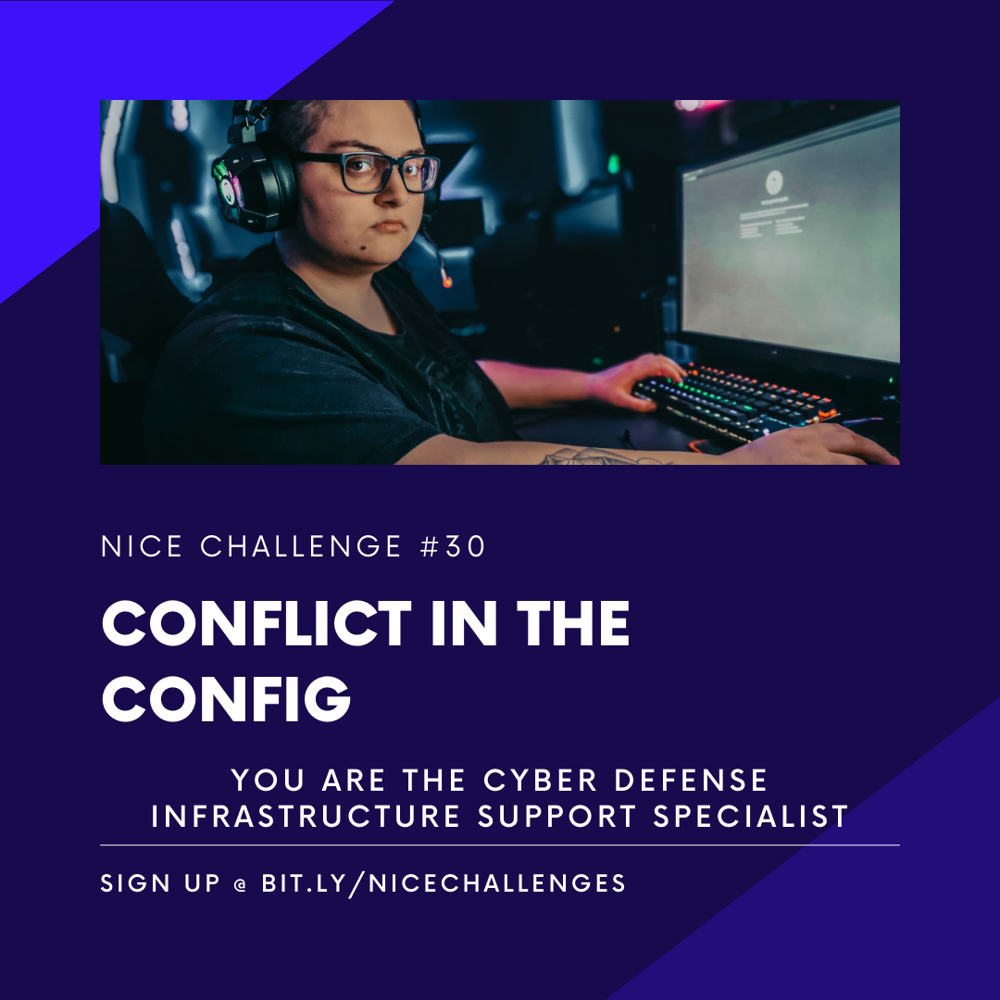
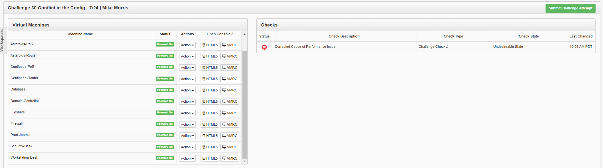

# Challenge 30 Conflict in the Config



## Author
```
Edna J.
WGU NICE Challenge
Pretty Safe Electronics
7/25/2021
```

## Challenge Details
```
Challenge #T0483
Conflict in the Config
Author: Alexander Hillock
Framework Category: Protect and Defend
Specialty Area: Cybersecurity Defense Infrastructure Support
Work Role: Cyber Defense Infrastructure Support Specialist
Task Description: Identify potential conflicts with implementation of any cyber defense tools (e.g., tool and signature testing and optimization).
```


### Scenario
We have had reports that our website has been slowing down during peak hours and aren't sure what is causing the performance drop. Your job is to identify what is causing the issue and remediate it as quickly as possible.

-----
## Meeting Briefing


---
## Tools used

 - List item 1
 - List item 2
 - List item 3


## Steps taken to complete the required actions

Starting off, I have the following machines available for me to access and checks left to complete



I was given the following Network diagram map


#### The tasks that I was working on completing were
 - List item 1
 - List item 2
 - List item 3


### Task 1 Heading

### Task 2 Heading


(Get this info before deploying challenge or after)
### NICE Framework KSA

- A0123. Ability to apply cybersecurity and privacy principles to organizational requirements (relevant to confidentiality, integrity, availability, authentication, non-repudiation).
- K0001. Knowledge of computer networking concepts and protocols, and network security methodologies.
- K0004. Knowledge of cybersecurity and privacy principles.
- K0044. Knowledge of cybersecurity and privacy principles and organizational requirements (relevant to confidentiality, integrity, availability, authentication, non-repudiation).
- K0058. Knowledge of network traffic analysis methods.
- K0061. Knowledge of how traffic flows across the network (e.g., Transmission Control Protocol [TCP] and Internet Protocol [IP], Open System Interconnection Model [OSI], Information Technology Infrastructure Library, current version [ITIL]).
- K0205. Knowledge of basic system, network, and OS hardening techniques.
- K0324. Knowledge of Intrusion Detection System (IDS)/Intrusion Prevention System (IPS) tools and applications.
- K0332. Knowledge of network protocols such as TCP/IP, Dynamic Host Configuration, Domain Name System (DNS), and directory services.
- K0334. Knowledge of network traffic analysis (tools, methodologies, processes).
- S0053. Skill in tuning sensors.
- S0121. Skill in system, network, and OS hardening techniques. (e.g., remove unnecessary services, password policies, network segmentation, enable logging, least privilege, etc.).
- S0124. Skill in troubleshooting and diagnosing cyber defense infrastructure anomalies and work through resolution.


### CAE Knowledge Units
- Basic Networking
- Cybersecurity Principles
- IA Standards
- Intrusion Detection/Prevention Systems
- IT Systems Components
- Linux System Administration
- Network Defense
- Network Security Administration
- Network Technology and Protocols

## References:

