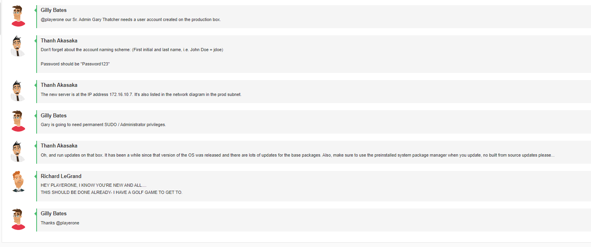
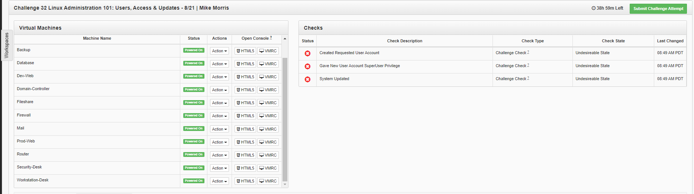
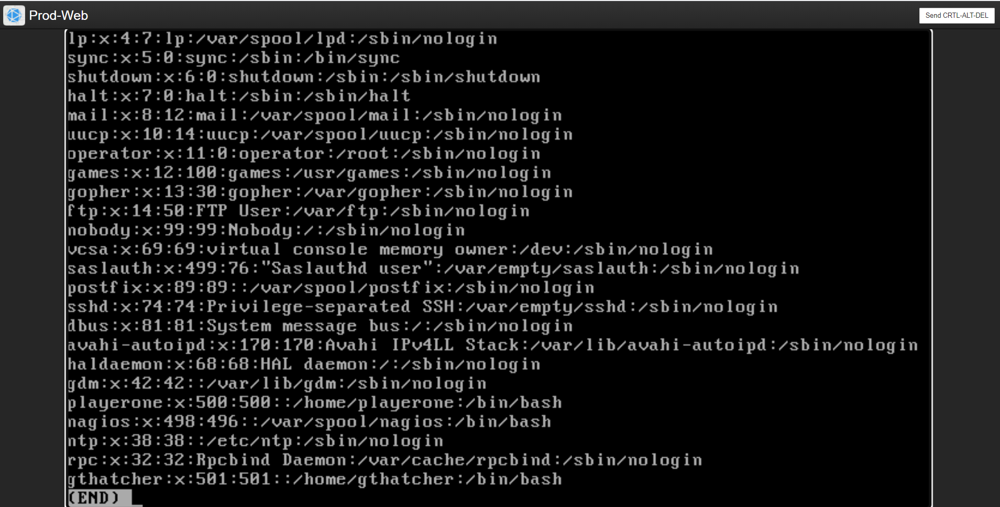
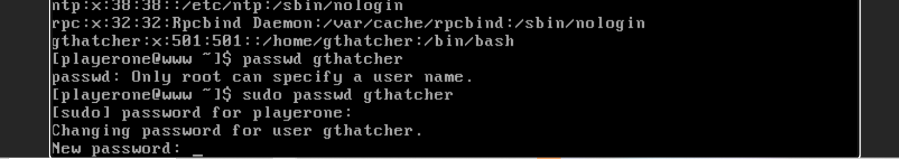
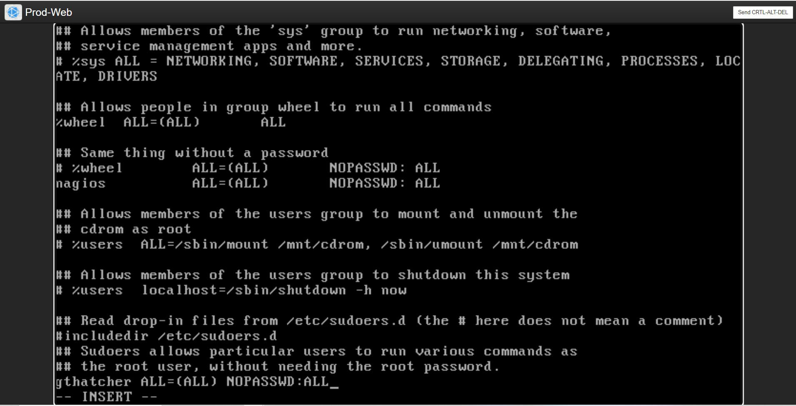
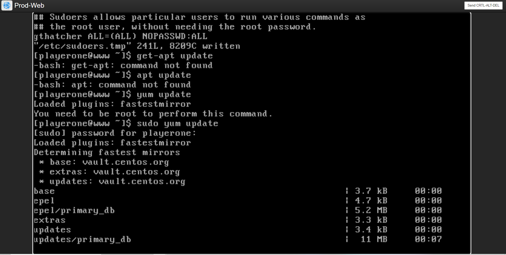
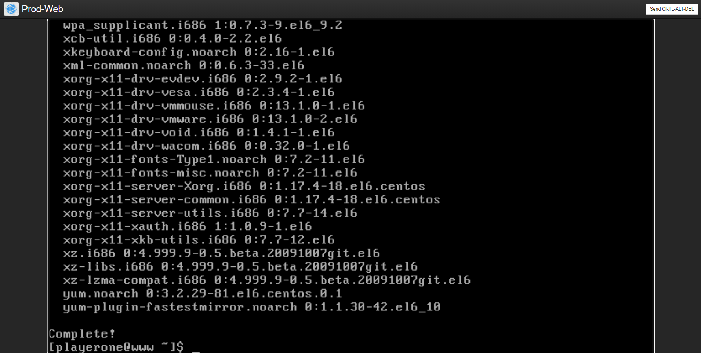
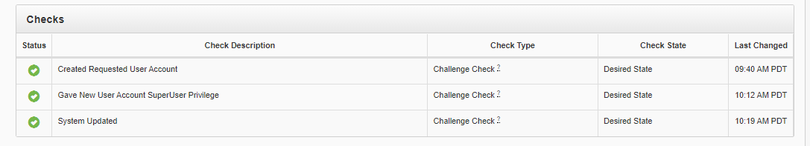

# Challenge 33 - Linux Administration 101: Users, Access & Updates


## Author
```
Edna J.
WGU NICE Challenge
DASWebs Inc
8/22/2021
```

## Challenge Details
```
Author: James D. Ashley III
Framework Category: Operate and Maintain
Specialty Area: Systems Administration
Work Role: System Administrator
Task Description: Install, update, and troubleshoot systems/servers. (T0418)
```

### Scenario

We recently acquired a new server, put a base Linux install on it, and put it in the production subnet. This new server is going to be our production web server and we need you to get it ready for prime time. Some basic accounts will need to be added to it and given the right level of authority. Also, the server needs to be updated to the latest base packages before we let the developers into it to start loading up their stuff.

-----
## Meeting Briefing



`Gilly Bates`
@playerone our Sr. Admin Gary Thatcher needs a user account created on the production box.

`Thanh Akasaka`
Don't forget about the account naming scheme: (First initial and last name, i.e. John Doe = jdoe)

Password should be "Password123"

`Thanh Akasaka`
The new server is at the IP address 172.16.10.7. It's also listed in the network diagram in the prod subnet.

`Gilly Bates`
Gary is going to need permanent SUDO / Administrator privileges.

`Thanh Akasaka`
Oh, and run updates on that box. It has been a while since that version of the OS was released and there are lots of updates for the base packages. Also, make sure to use the preinstalled system package manager when you update, no built from source updates please...

`Richard LeGrand`
HEY PLAYERONE, I KNOW YOU'RE NEW AND ALL....
THIS SHOULD BE DONE ALREADY- I HAVE A GOLF GAME TO GET TO.

`Gilly Bates`
Thanks @playerone


---
## Commands used

 - useradd
 - passwd
 - visudo


## Steps taken to complete the required actions

Starting off, I have the following machines available for me to access and checks left to complete



I was given the following Network diagram map


#### The tasks that I was working on completing were
 - Create User Account
 - Set permissions to SUDO / Administrator privileges
 - Run updates


## Task 1 Create User Account
Sr. Admin Gary Thatcher needs a user account created on the production box.
Don't forget about the account naming scheme: (First initial and last name, i.e. John Doe = jdoe)

Password should be "Password123"

First thing I did was run the command `sudo useradd gthatcher`

 Then to check the user was added, I ran `less /etc/passwd` 



Here I see that `gthatcher` has been added to the passwd file. 

Now I'm going to set the password for this user. I run the command `sudo passwd gthatcher` and then I enter the new password "Password123" and ignore the warning about BAD PASSWORD because I'm using a dictionary word. (Sidenote: Using the dictionary word Password in your password is not a secure practice and we should encourage this user to change their password to a more complex password.)



## Task 2 Set permissions to SUDO / Administrator privileges

There's a couple of ways to give a user SUDO privileges. The first one is utilizing the usermod command. This did not work on this machine, so I went to the other way which is to edit the Sudoers file. To do that, run `visudo` which opens up the sudoers file using the vi editor. To use Nano instead, first run `EDITOR=nano visudo`. Once in this file, go to the end, and add the following line:

`gthatcher  ALL=(ALL) NOPASSWD:ALL`


## Task 3 Run updates
Oh, and run updates on that box. It has been a while since that version of the OS was released and there are lots of updates for the base packages. Also, make sure to use the preinstalled system package manager when you update, no built from source updates please...

I ran the command 
`yum update`



I let this cook for a while, the computer might go through some reboots and you might have a black screen for a bit, you should be able to click on the black screen and it will show the terminal again.

Once it's finished, the final output should look like this and then you can exit from the computer.



Now that I've completed all of the required steps I see that all of my checkmarks have turned green.



### NICE Framework KSA

- K0088. Knowledge of systems administration concepts.
- K0158. Knowledge of organizational information technology (IT) user security policies (e.g., account creation, password rules, access control).
- K0167. Knowledge of system administration, network, and operating system hardening techniques.
- K0318. Knowledge of operating system command-line tools.
- S0016. Skill in configuring and optimizing software.
- S0143. Skill in conducting system/server planning, management, and maintenance.
- S0144. Skill in correcting physical and technical problems that impact system/server performance.
- S0153. Skill in identifying and anticipating system/server performance, availability, capacity, or configuration problems.
- S0154. Skill in installing system and component upgrades. (i.e., servers, appliances, network devices).
- S0158. Skill in operating system administration. (e.g., account maintenance, data backups, maintain system performance, install and configure new hardware/software).

### CAE Knowledge Units
- Cybersecurity Foundations
- IT Systems Components
- Linux System Administration
- Operating Systems Concepts

## References:
How to add a new user in Linux
https://linuxize.com/post/how-to-create-users-in-linux-using-the-useradd-command/

How to list users in Linux
https://linuxize.com/post/how-to-list-users-in-linux/

How to change a users password in Linux
https://www.cyberciti.biz/faq/linux-set-change-password-how-to/

Add users to Sudoers in Linux
https://linuxize.com/post/how-to-add-user-to-sudoers-in-ubuntu/

How to do a Linux update
https://www.linux.com/training-tutorials/linux-101-updating-your-system/