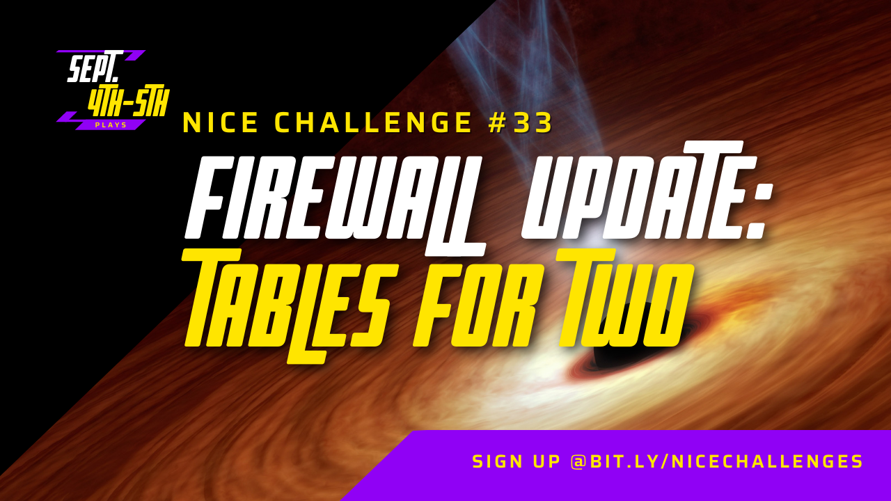
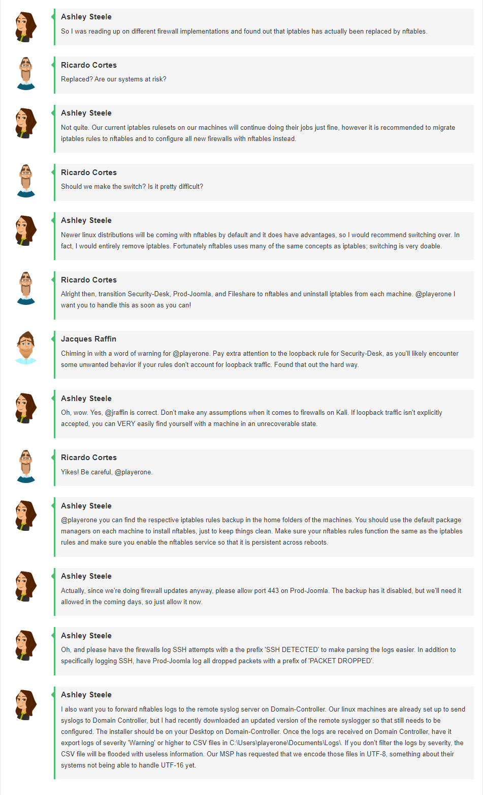
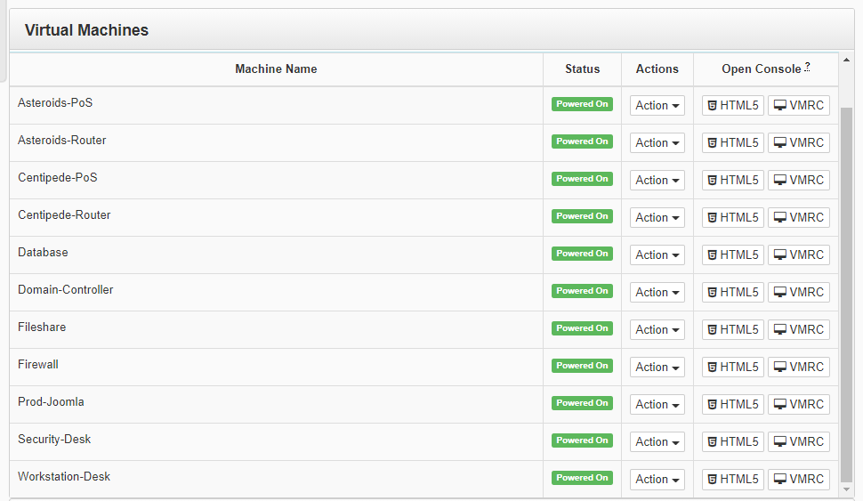
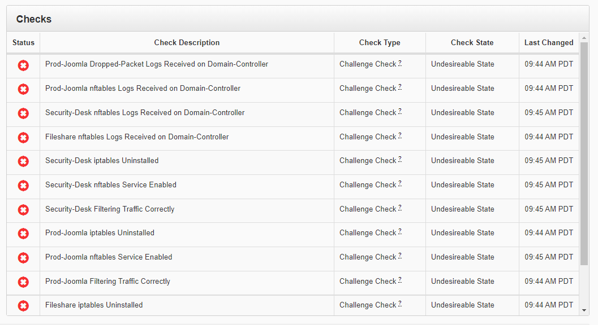
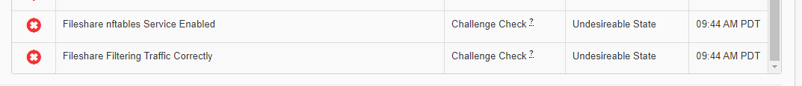
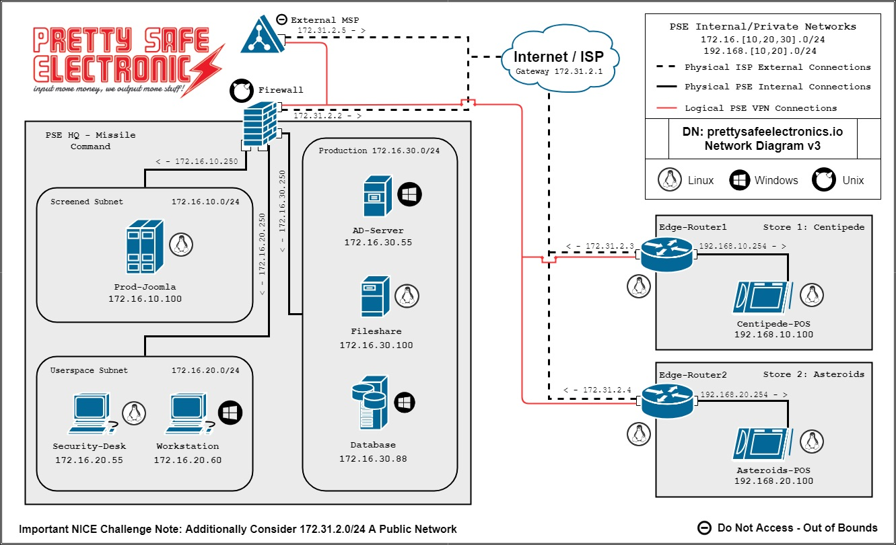
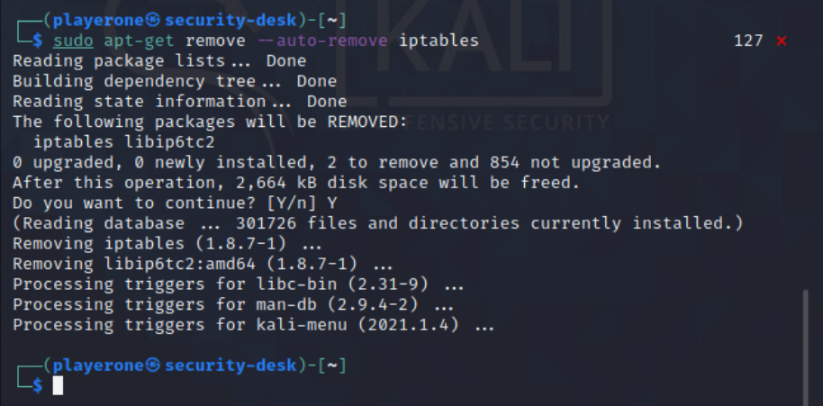
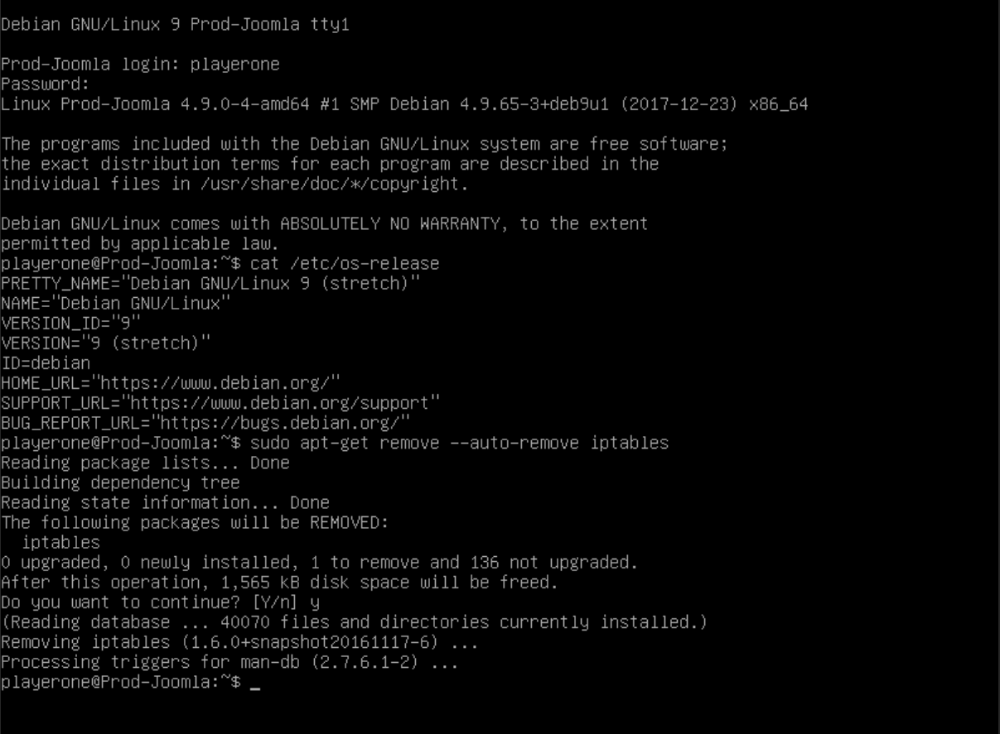
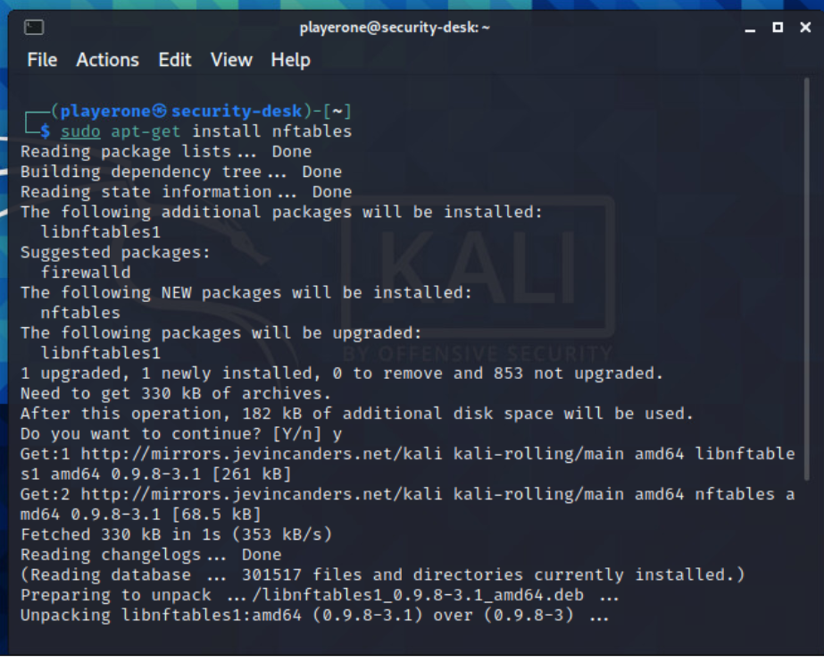

# Challenge 33 Firewall Update: Tables for Two



## Author
```
Edna J.
WGU NICE Challenge
Pretty Safe Electronics
9/4/2021
```

## Challenge Details
```
Author: James Block
Framework Category: Protect and Defend
Specialty Area: Cybersecurity Defense Infrastructure Support
Work Role: Cyber Defense Infrastructure Support Specialist
Task Description: Perform system administration on specialized cyber defense applications and systems (e.g., antivirus, audit and remediation) or Virtual Private Network (VPN) devices, to include installation, configuration, maintenance, backup, and restoration. (T0180) 
```

### Scenario
The way firewalls in Linux are implemented is changing. We need you to make sure our Linux boxes are keeping up with those changes so that we don't create any problems for ourselves in the future.

-----
## Meeting Briefing



`Ashley Steele`
So I was reading up on different firewall implementations and found out that iptables has actually been replaced by nftables.

`Ricardo Cortes`
Replaced? Are our systems at risk?

`Ashley Steele`
Not quite. Our current iptables rulesets on our machines will continue doing their jobs just fine, however it is recommended to migrate iptables rules to nftables and to configure all new firewalls with nftables instead.

`Ricardo Cortes`
Should we make the switch? Is it pretty difficult?

`Ashley Steele`
Newer linux distributions will be coming with nftables by default and it does have advantages, so I would recommend switching over. In fact, I would entirely remove iptables. Fortunately nftables uses many of the same concepts as iptables; switching is very doable.

`Ricardo Cortes`
Alright then, transition Security-Desk, Prod-Joomla, and Fileshare to nftables and uninstall iptables from each machine. @playerone I want you to handle this as soon as you can!

`Jacques Raffin`
Chiming in with a word of warning for @playerone. Pay extra attention to the loopback rule for Security-Desk, as you'll likely encounter some unwanted behavior if your rules don't account for loopback traffic. Found that out the hard way.

`Ashley Steele`
Oh, wow. Yes, @jraffin is correct. Don't make any assumptions when it comes to firewalls on Kali. If loopback traffic isn't explicitly accepted, you can VERY easily find yourself with a machine in an unrecoverable state.

`Ricardo Cortes`
Yikes! Be careful, @playerone.

`Ashley Steele`
@playerone you can find the respective iptables rules backup in the home folders of the machines. You should use the default package managers on each machine to install nftables, just to keep things clean. Make sure your nftables rules function the same as the iptables rules and make sure you enable the nftables service so that it is persistent across reboots.

`Ashley Steele`
Actually, since we're doing firewall updates anyway, please allow port 443 on Prod-Joomla. The backup has it disabled, but we'll need it allowed in the coming days, so just allow it now.

`Ashley Steele`
Oh, and please have the firewalls log SSH attempts with a the prefix 'SSH DETECTED' to make parsing the logs easier. In addition to specifically logging SSH, have Prod-Joomla log all dropped packets with a prefix of 'PACKET DROPPED'.

`Ashley Steele`
I also want you to forward nftables logs to the remote syslog server on Domain-Controller. Our linux machines are already set up to send syslogs to Domain Controller, but I had recently downloaded an updated version of the remote syslogger so that still needs to be configured. The installer should be on your Desktop on Domain-Controller. Once the logs are received on Domain Controller, have it export logs of severity 'Warning' or higher to CSV files in C:\Users\playerone\Documents\Logs\. If you don't filter the logs by severity, the CSV file will be flooded with useless information. Our MSP has requested that we encode those files in UTF-8, something about their systems not being able to handle UTF-16 yet.


---
## Tools used

 - List item 1
 - List item 2
 - List item 3


## Steps taken to complete the required actions

Starting off, I have the following machines available for me to access and checks left to complete






- Prod-Joomla Dropped-Packet Logs Received on Domain-Controller	
- Prod-Joomla nftables Logs Received on Domain-Controller	
- Security-Desk nftables Logs Received on Domain-Controller	
- Fileshare nftables Logs Received on Domain-Controller	
- Security-Desk iptables Uninstalled
- Security-Desk nftables Service Enabled
- Security-Desk Filtering Traffic Correctly	
- Prod-Joomla iptables Uninstalled	
- Prod-Joomla nftables Service Enabled
- Prod-Joomla Filtering Traffic Correctly	
- Fileshare iptables Uninstalled	
- Fileshare nftables Service Enabled	
- Fileshare Filtering Traffic Correctly	


I was given the following Network diagram map



***Important to know***
```
Syslog is on AD-Server - 172.16.30.55, using port 514 UDP
Prod-Joomla - 172.16.10.100
Security-Desk - 172.16.20.55
Fileshare - 172.16.30.100
```

## The tasks that I was working on completing were
 - Receive logs on the Domain-Controller for nftables logs on Prod-Joomla, Security-Desk and Fileshare
 - Receive logs on the Domain-Controller for Dropped-Packets on Prod-Joomla
 - Uninstall iptables and enable nftables on Security-Desk, Prod-Joomla and Fileshare
 - Filter traffic correctly on Fileshare


## Task 1 Receive logs on the Domain-Controller for nftables logs on Prod-Joomla, Security-Desk and Fileshare
```
Ashley Steele in the meeting said "I also want you to forward nftables logs to the remote syslog server on Domain-Controller. Our linux machines are already set up to send syslogs to Domain Controller, but I had recently downloaded an updated version of the remote syslogger so that still needs to be configured. The installer should be on your Desktop on Domain-Controller. Once the logs are received on Domain Controller, have it export logs of severity 'Warning' or higher to CSV files in C:\Users\playerone\Documents\Logs\. If you don't filter the logs by severity, the CSV file will be flooded with useless information. Our MSP has requested that we encode those files in UTF-8, something about their systems not being able to handle UTF-16 yet."
```


## Task 2 Receive logs on the Domain-Controller for Dropped-Packets on Prod-Joomla
From the meeting
```
Actually, since we're doing firewall updates anyway, please allow port 443 on Prod-Joomla. The backup has it disabled, but we'll need it allowed in the coming days, so just allow it now. 
Oh, and please have the firewalls log SSH attempts with a the prefix 'SSH DETECTED' to make parsing the logs easier. In addition to specifically logging SSH, have Prod-Joomla log all dropped packets with a prefix of 'PACKET DROPPED'
```
With this information 

allow port 443 on Prod-Joomla


tcp dport ssh limit rate 2/minute log prefix "SSH connection" accept


## Task 3 Uninstall iptables and enable nftables on Security-Desk, Prod-Joomla and Fileshare
Done on Kali, Ubuntu
Uninstall iptabless
`sudo apt-get remove --auto-remove iptables
For security desk

For Prod-Joomla


Install NFtables
`sudo apt-get install nftables`


Enable nftables
`systemctl enable nftables.service`


## Task 4 Filter traffic correctly on Fileshare


(Get this info before deploying challenge or after)
### NICE Framework KSA


### CAE Knowledge Units


## References:
Syslog watcher https://ezfive.com/syslog-watcher/

How to Remotely Collect server events using syslog
https://www.howtogeek.com/107069/how-to-remotely-collect-server-events-using-syslog/

Logging traffic nftables
https://wiki.nftables.org/wiki-nftables/index.php/Logging_traffic

Uninstall iptables https://www.cyberciti.biz/faq/linux-howto-disable-remove-firewall/

Nftables https://wiki.debian.org/nftables