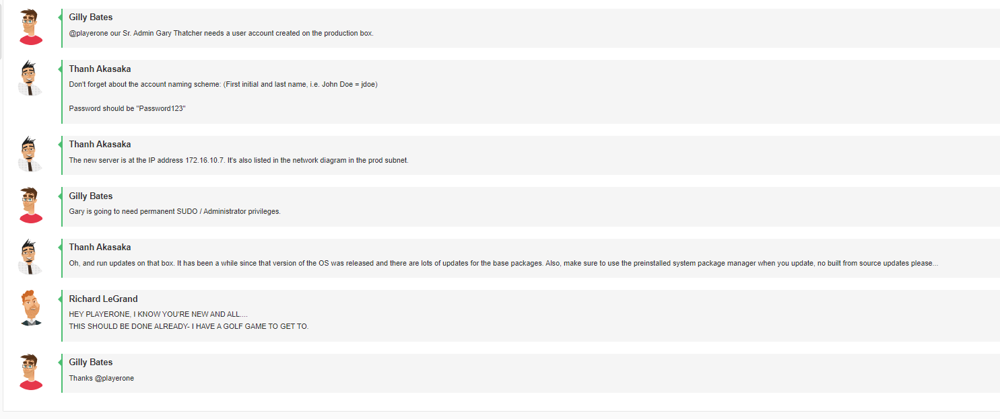
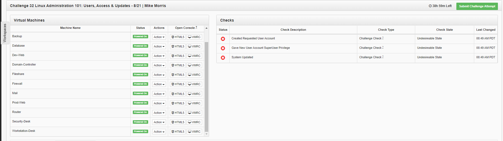
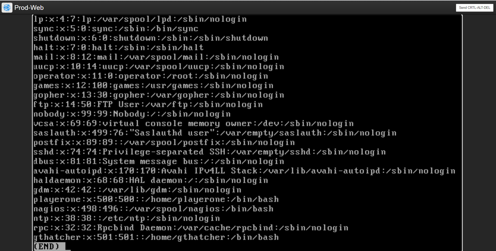

# Challenge 33 - Linux Administration 101: Users, Access & Updates

## Author
```
Edna J.
WGU NICE Challenge
DASWebs Inc
8/22/2021
```

## Challenge Details
```
Author: James D. Ashley III
Framework Category: Operate and Maintain
Specialty Area: Systems Administration
Work Role: System Administrator
Task Description: Install, update, and troubleshoot systems/servers. (T0418)
```

### Scenario

We recently acquired a new server, put a base Linux install on it, and put it in the production subnet. This new server is going to be our production web server and we need you to get it ready for prime time. Some basic accounts will need to be added to it and given the right level of authority. Also, the server needs to be updated to the latest base packages before we let the developers into it to start loading up their stuff.

-----
## Meeting Briefing



`Gilly Bates`
@playerone our Sr. Admin Gary Thatcher needs a user account created on the production box.

`Thanh Akasaka`
Don't forget about the account naming scheme: (First initial and last name, i.e. John Doe = jdoe)

Password should be "Password123"

`Thanh Akasaka`
The new server is at the IP address 172.16.10.7. It's also listed in the network diagram in the prod subnet.

`Gilly Bates`
Gary is going to need permanent SUDO / Administrator privileges.

`Thanh Akasaka`
Oh, and run updates on that box. It has been a while since that version of the OS was released and there are lots of updates for the base packages. Also, make sure to use the preinstalled system package manager when you update, no built from source updates please...

`Richard LeGrand`
HEY PLAYERONE, I KNOW YOU'RE NEW AND ALL....
THIS SHOULD BE DONE ALREADY- I HAVE A GOLF GAME TO GET TO.

`Gilly Bates`
Thanks @playerone


---
## Tools used

 - List item 1
 - List item 2
 - List item 3


## Steps taken to complete the required actions

Starting off, I have the following machines available for me to access and checks left to complete



I was given the following Network diagram map


#### The tasks that I was working on completing were
 - Create User Account
 - Set permissions to SUDO / Administrator privileges
 - Run updates


### Task 1 Create User Account
Sr. Admin Gary Thatcher needs a user account created on the production box.
Don't forget about the account naming scheme: (First initial and last name, i.e. John Doe = jdoe)

Password should be "Password123"

First thing I did was run the command
`sudo useradd gthatcher`
 Then to check the user was added, I ran
 `less /etc/passwd`


I see that `gthatcher` has been added to the passwd file. 

Now I'm going to set the password for this user.


### Task 2 Set permissions to SUDO / Administrator privileges


### Task 3 Run updates
Oh, and run updates on that box. It has been a while since that version of the OS was released and there are lots of updates for the base packages. Also, make sure to use the preinstalled system package manager when you update, no built from source updates please...


### NICE Framework KSA


### CAE Knowledge Units


## References:

How to list users in Linux
https://linuxize.com/post/how-to-list-users-in-linux/

How to change a users password in Linux
https://www.cyberciti.biz/faq/linux-set-change-password-how-to/


Add users to Sudoers in Linux
https://linuxize.com/post/how-to-add-user-to-sudoers-in-ubuntu/