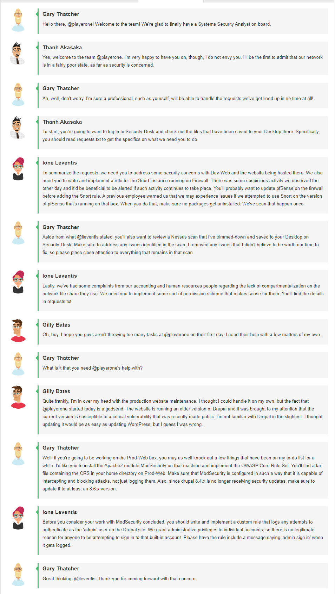
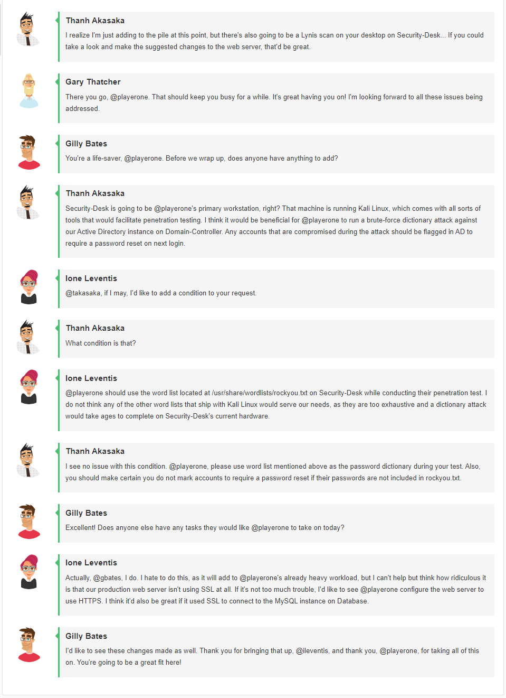
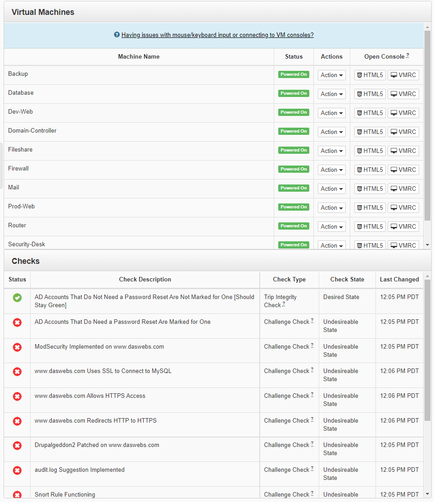
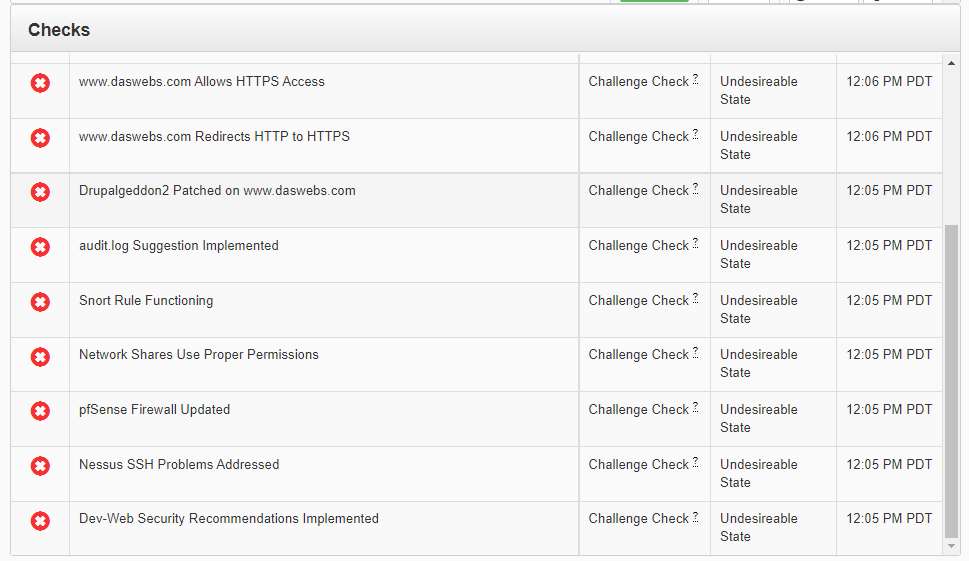

# Challenge NUM  NAME OF CHALLENGE

## Author
```
Edna J.
WGU NICE Challenge
DASWebs Inc
9/18/2021
```

## Challenge Details
```
Author: Bailey Kasin & Robert Hancock
Framework Category: Operate and Maintain
Specialty Area: Systems Analysis
Work Role: Systems Security Analyst
Task Description: Implement security measures to resolve vulnerabilities, mitigate risks, and recommend security changes to system or system components as needed. (T0485)
```


### Scenario
Daswebs is in desperate need of a new employee to accomplish a range of tasks typically required of a systems security analyst. Your goal is to accomplish as many of the requests that are provided by your co-workers as possible.


-----
## Meeting Briefing





`Gary Thatcher`
Hello there, @playerone! Welcome to the team! We're glad to finally have a Systems Security Analyst on board.

`Thanh Akasaka`
Yes, welcome to the team @playerone. I'm very happy to have you on, though, I do not envy you. I'll be the first to admit that our network is in a fairly poor state, as far as security is concerned.

`Gary Thatcher`
Ah, well, don't worry. I'm sure a professional, such as yourself, will be able to handle the requests we've got lined up in no time at all!

`Thanh Akasaka`
To start, you're going to want to log in to Security-Desk and check out the files that have been saved to your Desktop there. Specifically, you should read requests.txt to get the specifics on what we need you to do.

`Ione Leventis`
To summarize the requests, we need you to address some security concerns with Dev-Web and the website being hosted there. We also need you to write and implement a rule for the Snort instance running on Firewall. There was some suspicious activity we observed the other day and it'd be beneficial to be alerted if such activity continues to take place. You'll probably want to update pfSense on the firewall before adding the Snort rule. A previous employee warned us that we may experience issues if we attempted to use Snort on the version of pfSense that's running on that box. When you do that, make sure no packages get uninstalled. We've seen that happen once.

`Gary Thatcher`
Aside from what @ileventis stated, you'll also want to review a Nessus scan that I've trimmed-down and saved to your Desktop on Security-Desk. Make sure to address any issues identified in the scan. I removed any issues that I didn't believe to be worth our time to fix, so please place close attention to everything that remains in that scan.

`Ione Leventis`
Lastly, we've had some complaints from our accounting and human resources people regarding the lack of compartmentalization on the network file share they use. We need you to implement some sort of permission scheme that makes sense for them. You'll find the details in requests.txt.

`Gilly Bates`
Oh, boy. I hope you guys aren't throwing too many tasks at @playerone on their first day. I need their help with a few matters of my own.

`Gary Thatcher`
What is it that you need @playerone's help with?

`Gilly Bates`
Quite frankly, I'm in over my head with the production website maintenance. I thought I could handle it on my own, but the fact that @playerone started today is a godsend. The website is running an older version of Drupal and it was brought to my attention that the current version is susceptible to a critical vulnerability that was recently made public. I'm not familiar with Drupal in the slightest. I thought updating it would be as easy as updating WordPress, but I guess I was wrong.

`Gary Thatcher`
Well, if you're going to be working on the Prod-Web box, you may as well knock out a few things that have been on my to-do list for a while. I'd like you to install the Apache2 module ModSecurity on that machine and implement the OWASP Core Rule Set. You'll find a tar file containing the CRS in your home directory on Prod-Web. Make sure that ModSecurity is configured in such a way that it is capable of intercepting and blocking attacks, not just logging them. Also, since drupal 8.4.x is no longer receiving security updates, make sure to update it to at least an 8.6.x version.

`Ione Leventis`
Before you consider your work with ModSecurity concluded, you should write and implement a custom rule that logs any attempts to authenticate as the 'admin' user on the Drupal site. We grant administrative privileges to individual accounts, so there is no legitimate reason for anyone to be attempting to sign in to that built-in account. Please have the rule include a message saying 'admin sign in' when it gets logged.

`Gary Thatcher`
Great thinking, @ileventis. Thank you for coming forward with that concern.

`Thanh Akasaka`
I realize I'm just adding to the pile at this point, but there's also going to be a Lynis scan on your desktop on Security-Desk... If you could take a look and make the suggested changes to the web server, that'd be great.

`Gary Thatcher`
There you go, @playerone. That should keep you busy for a while. It's great having you on! I'm looking forward to all these issues being addressed.

`Gilly Bates`
You're a life-saver, @playerone. Before we wrap up, does anyone have anything to add?

`Thanh Akasaka`
Security-Desk is going to be @playerone's primary workstation, right? That machine is running Kali Linux, which comes with all sorts of tools that would facilitate penetration testing. I think it would be beneficial for @playerone to run a brute-force dictionary attack against our Active Directory instance on Domain-Controller. Any accounts that are compromised during the attack should be flagged in AD to require a password reset on next login.

`Ione Leventis`
@takasaka, if I may, I'd like to add a condition to your request.

`Thanh Akasaka`
What condition is that?

`Ione Leventis`
@playerone should use the word list located at /usr/share/wordlists/rockyou.txt on Security-Desk while conducting their penetration test. I do not think any of the other word lists that ship with Kali Linux would serve our needs, as they are too exhaustive and a dictionary attack would take ages to complete on Security-Desk's current hardware.

`Thanh Akasaka`
I see no issue with this condition. @playerone, please use word list mentioned above as the password dictionary during your test. Also, you should make certain you do not mark accounts to require a password reset if their passwords are not included in rockyou.txt.

`Gilly Bates`
Excellent! Does anyone else have any tasks they would like @playerone to take on today?

`Ione Leventis`
Actually, @gbates, I do. I hate to do this, as it will add to @playerone's already heavy workload, but I can't help but think how ridiculous it is that our production web server isn't using SSL at all. If it's not too much trouble, I'd like to see @playerone configure the web server to use HTTPS. I think it'd also be great if it used SSL to connect to the MySQL instance on Database.

`Gilly Bates`
I'd like to see these changes made as well. Thank you for bringing that up, @ileventis, and thank you, @playerone, for taking all of this on. You're going to be a great fit here!

---
## Tools used

 - List item 1
 - List item 2
 - List item 3


## Steps taken to complete the required actions

Starting off, I have the following machines available for me to access and checks left to complete



I was given the following Network diagram map


#### The tasks that I was working on completing were
 - List item 1
 - List item 2
 - List item 3


### Task 1 Heading

### Task 2 Heading


(Get this info before deploying challenge or after)
### NICE Framework KSA


### CAE Knowledge Units


## References:

