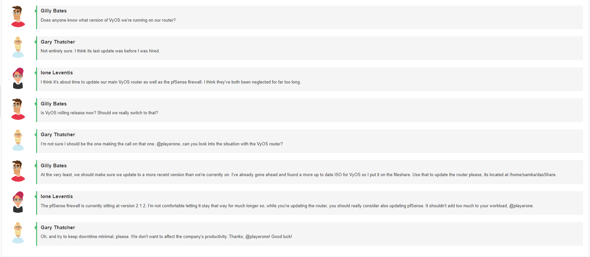
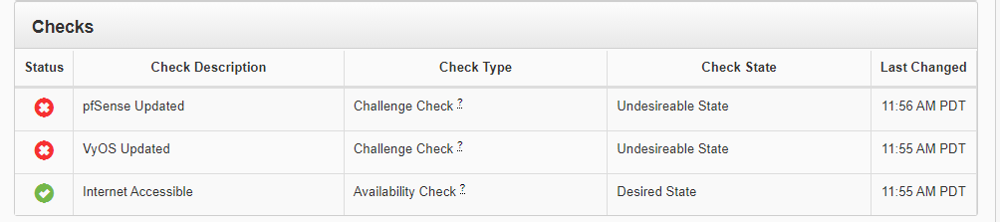

# Challenge 35 Security Begins & Never Ends with Updates: Networking Edition

## Author
```
Edna J.
WGU NICE Challenge
DASWebs Inc
9/18/2021
```

## Challenge Details


### Scenario


-----
## Meeting Briefing



`Gilly Bates`

Does anyone know what version of VyOS we're running on our router?

`Gary Thatcher`
Not entirely sure. I think its last update was before I was hired.

`Ione Leventis`
I think it's about time to update our main VyOS router as well as the pfSense firewall. I think they've both been neglected for far too long.

`Gilly Bates`
Is VyOS rolling release now? Should we really switch to that?

`Gary Thatcher`
I'm not sure I should be the one making the call on that one. @playerone, can you look into the situation with the VyOS router?

`Gilly Bates`
At the very least, we should make sure we update to a more recent version than we're currently on. I've already gone ahead and found a more up to date ISO for VyOS so I put it on the fileshare. Use that to update the router please, its located at /home/samba/dasShare.

`Ione Leventis`
The pfSense firewall is currently sitting at version 2.1.2. I'm not comfortable letting it stay that way for much longer so, while you're updating the router, you should really consider also updating pfSense. It shouldn't add too much to your workload, @playerone.

`Gary Thatcher`
Oh, and try to keep downtime minimal, please. We don't want to affect the company's productivity. Thanks, @playerone! Good luck!


---
## Tools used

 - List item 1
 - List item 2
 - List item 3


## Steps taken to complete the required actions

Starting off, I have the following machines available for me to access and checks left to complete



I was given the following Network diagram map


#### The tasks that I was working on completing were
 - List item 1
 - List item 2
 - List item 3


### Task 1 Heading

### Task 2 Heading


(Get this info before deploying challenge or after)
### NICE Framework KSA


### CAE Knowledge Units


## References:

