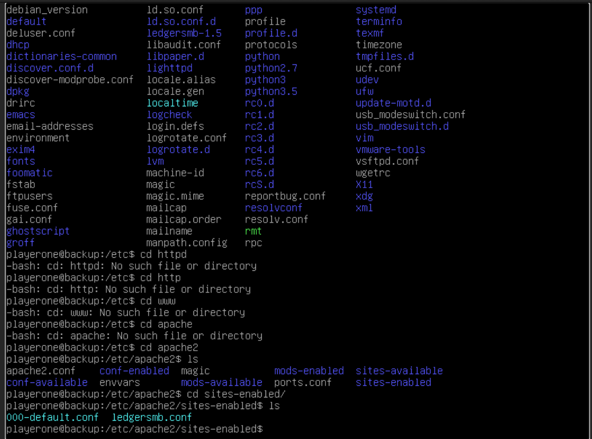

# Challenge 7  Helpdesk Fun: Disappearing Drives & Web Apps

## Author
    Edna J.
    WGU NICE Challenge
    DAS Webs Inc.
    April 2nd, 2022

## Challenge Details
**Author:** Jeff Echlin
**Framework Category:** Operate and Maintain
**Specialty Area:** Customer Service and Technical Support
**Work Role:** Technical Support Specialist
**Task Description:** Troubleshoot system hardware and software.

### Scenario
You have been busy as DAS Webs Inc.'s new help desk personnel. Today you have been assigned two troubleshooting issues:

1. Sergio Chanel recently put in a requisition for a new small internal hard drive so he could store any intermediate employee performance reports and other performance data before they are committed to the company HR file share. He requested that this drive be mapped with a drive letter of R. He reports that the drive worked initially but became slow. He explained that he "fiddled" with some settings in the hope that he could fix the general sluggishness. He was hoping that he would be able to avoid asking for help, but now, for some reason, the drive no longer shows up at all. Help him fix this issue.

2. Sergio Chanel needs to change some contact information for an employee that just moved to a satellite branch of DAS Webs. Sergio tried to log into Ledger SMB to record the changes. However, when navigating to the LedgerSMB web page he reported an error. Please restore functionality to LedgerSMB again.

-----
## Meeting Briefing

`Gilly Bates @gbates`
Hi there @playerone! Welcome to your new position as a DASWebs help desk technician. @gthatcher, our senior admin, has tasked me with fixing @schanel's various issues, however, I have decided to delegate this task to you for your first assignment.

`Sergio Chanel @schanel`
My R drive is running very slowly! I didn't feel like bothering anyone with this, so I fiddled with a few settings hoping to fix the sluggishness.

`Sergio Chanel @schanel`
Now my drive and access to LedgerSMB no longer work! This is fabulously frustrating as I can not get any of my work done!!

`Gilly Bates @gbates`
@playerone Sergio is having some major problems with the network share he uses called 'HR' with a drive letter of R. Because of his 'fiddling' the drive no longer shows up at all. Furthermore, @schanel is also having problems with LedgerSMB; he can't access the web interface anymore.

`Gilly Bates @gbates`
We currently host both LedgerSMB and DasWebsWiki on the Backup machine. DasWebsWiki was configured first and must be accessible on port 80, while LedgerSMB should be accessible on port 8080.

`Gilly Bates @gbates`
@playerone, please map Fileshare's "HR" share to "R:" using your account on Workstation-Desk. Once you've documented a solution, we can repeat the process to map it for Sergio. Also, please make LedgerSMB's web interface accessible again, as this issue affects the whole company.

---
## Tools used

 - Vim
 - Linux
 - Google

## Steps taken to complete the required actions

Starting off, I have the following machines available for me to access and checks left to complete

I was given the following Network diagram map

#### The tasks that I was working on completing were
 - Network Share Mapped
 - LedgerSMB and DasWebsWiki Accessible

### Task 1 Network Share Mapped

During the meeting Gary Bates told me "Sergio is having some major problems with the network share he uses called 'HR' with a drive letter of R. Because of his 'fiddling' the drive no longer shows up at all. Furthermore, @schanel is also having problems with LedgerSMB; he can't access the web interface anymore." Based on that information I considered going in to create a group policy for mapping this drive, but then decided to go ahead and only map it for Sergio for now.

I logged into Sergio's workstation. I opened the file explorer and navigated to the network drive, I found the FILESHARE and within it the hr share. 
I right clicked and selected the Drive R to map to this File share. I left the "Reconnect at sign-in" check and clicked Finish. This allowed Sergio's drive to be mapped to R again.

An alternate method of doing this mapping is to open up command prompt as Administrator, then type the following command:
net use R: \\fileshare\hr

### Task 2 	LedgerSMB and DasWebsWiki Accessible

From my meeting earlier today, Gary Bates said "We currently host both LedgerSMB and DasWebsWiki on the Backup machine. DasWebsWiki was configured first and must be accessible on port 80, while LedgerSMB should be accessible on port 8080." 

My first step was to log in to the Backup machine. I ran the command Systemctl to find out which processes were running. This led me to discover that starman-ledgersmb.service had failed. I decided to try and restart that service.

I attemepted several times to restart the Starman LedgerSMB service and logging in with the available accounts. Brute forcing my way in was not working! Oh no!

I decided to go look for a web service that was running and looking into the possibility of a configuration issue. I checked for httpd, http, www folders, nothing... finally aha! Apache2 is installed!

I got into the Apache2 folder, I discovered a folder called sites-available. In there was a ledgersmb.conf file. I looked at that file and found a misconfiguration.

I edited the ledgersmb.conf file, using the command `sudo vim ledgersmb.conf` and changed all instances of port 80 to port 8080.

Now that I've made the changes, I need to restart the Apache2 server.

I run the command `sudo /etc/init.d/apache2 restart`

Everything restarted OK. I go and find that my checks have gone green.

(Get this info before deploying challenge or after)
### NICE Framework KSA
    K0001. Knowledge of computer networking concepts and protocols, and network security methodologies.
    K0053. Knowledge of measures or indicators of system performance and availability.
    K0088. Knowledge of systems administration concepts.
    K0109. Knowledge of physical computer components and architectures, including the functions of various components and peripherals (e.g., CPUs, Network Interface Cards, data storage).
    K0114. Knowledge of electronic devices (e.g., computer systems/components, access control devices, digital cameras, digital scanners, electronic organizers, hard drives, memory cards, modems, network components, networked appliances, networked home control devices, printers, removable storage devices, telephones, copiers, facsimile machines, etc.).
    K0292. Knowledge of the operations and processes for incident, problem, and event management.
    K0294. Knowledge of IT system operation, maintenance, and security needed to keep equipment functioning properly.
    K0302. Knowledge of the basic operation of computers.
    S0039. Skill in identifying possible causes of degradation of system performance or availability and initiating actions needed to mitigate this degradation.
    S0058. Skill in using the appropriate tools for repairing software, hardware, and peripheral equipment of a system.
    S0142. Skill in conducting research for troubleshooting novel client-level problems.
    S0159. Skill in configuring and validating network workstations and peripherals in accordance with approved standards and/or specifications.

### CAE Knowledge Units
    IT Systems Components
    Operating Systems Administration
    Operating Systems Concepts

## References:

Restart Apache 2 Server Command - https://www.cyberciti.biz/faq/star-stop-restart-apache2-webserver/