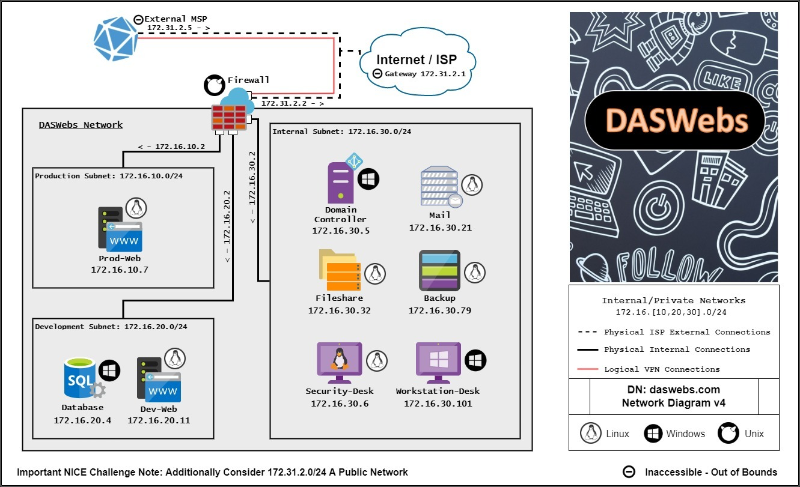

# Challenge 8 Lengthy Logs: Attack Analysis

## Author
    Edna J.
    WGU NICE Challenge
    DAS Webs Inc.
    April 24th, 2022

## Challenge Details
Perform event correlation using information gathered from a variety of sources within the enterprise to gain situational awareness and determine the effectiveness of an observed attack. (T0166)

### Scenario
Lately, employees have been having some issues logging in to one of our Wordpress websites and we can't figure out why. Our security analyst suspects that we might have been hit by a cyber attack, but is currently indisposed and can't look into it. I need you to take a look and confirm whether or not we were actually hit and if so, what the impact of that attack might have been.

-----
## Meeting Briefing

`Rob the Intern @robtheintern`
I tried to log into the WordPress site we are hosting on Prod-Web and couldn't get in. Not sure what's going on, can someone help?! I know I'm typing in my username and password right! I was able to get in yesterday!

`Gilly Bates @gbates`
Did you check your caps lock key? Wouldn't be the first time that's happened.

`Rob the Intern @robtheintern`
Yes I did!! I swear I have it right this time... Actually did you guys ever make my account?

`Gary Thatcher @gthatcher`
@rob actually I left that for @takasaka to do. But I actually can't get in to the website. Something is definitely up. Can we get confirmation by at least one more person?

`Thanh Akasaka @takasaka`
@rob sorry about that, I never got around to it since we have been back to back with projects. Confirmed, no luck for my login on the website either.

`Ione Leventis @ileventis`
Of course something like this would happen while I'm out sick. Especially right after we started allowing outside users to make subscriber accounts. @playerone I'm going to need your assistance here.

`Rob the Intern @robtheintern`
I don't understand how @playerone can even figure anything out if nobody can get into the website!

`Ione Leventis @ileventis`
Take a look at the logs maybe?

`Gilly Bates @gbates`
Yeah and lets not forget our website uses Database for everything. That could have been hit?

`Thanh Akasaka @takasaka`
Why would anything happen to our database? How would anyone even have access to that box?

`Gary Thatcher @gthatcher`
Interesting. @playerone start looking into what happened. I'm fairly certain we've been hit by an attack of some sort but maybe this happened because some part of our website was out of date?

`Thanh Akasaka @takasaka`
If something is wrong with that specific database can't @playerone just use the mysql backup located in /DatabaseBackup on the Backup machine? After all, that thing is backed up nightly.

`Ione Leventis @ileventis`
I mean theoretically yes that might fix the login issues but we need to get to the bottom of what occurred here. @playerone don't worry about restoring the database just figure out what occurred. The logs for the database service should be in 'C:\mysql_logs\' on Database.

`Gilly Bates @gbates`
Hey wait a second! Remember that old incident response form you had me set up a while back @gthatcher? Why don't we have @playerone use it? Seems like the perfect opportunity for this sort of thing! You can find it by navigating to Backup's IP address on a web browser from any machine within our network.

`Gary Thatcher @gthatcher`
Oh yeah! I forgot about that thing. Well there you go @playerone, if you find anything head over to the incident response form that is on the database box and fill it out! If I recall correctly @gbates set it up so that examples are given within the text fields as to how formatting should be done so just follow those! Also, don't use any special characters in the submission title other than the # sign. Just use the format that's given in the example and I'll be happy.

---
## Tools used

 - List item 1
 - List item 2
 - List item 3

## Steps taken to complete the required actions

Starting off, I have the following machines available for me to access and checks left to complete

I was given the following Network diagram map

#### The tasks that I was working on completing were
 - Correctly Reported Exploited Host and Service
 - Correctly Reported Exploited Service Log File Path
 - Correctly Reported Wordpress Account[s] Subjected to Tampering

### Task 1 Correctly Reported Exploited Host and Service

### Task 2 Correctly Reported Exploited Service Log File Path

### Task 3 Correctly Reported Wordpress Account[s] Subjected to Tampering 

### NICE Framework KSA

### CAE Knowledge Units

## References:

