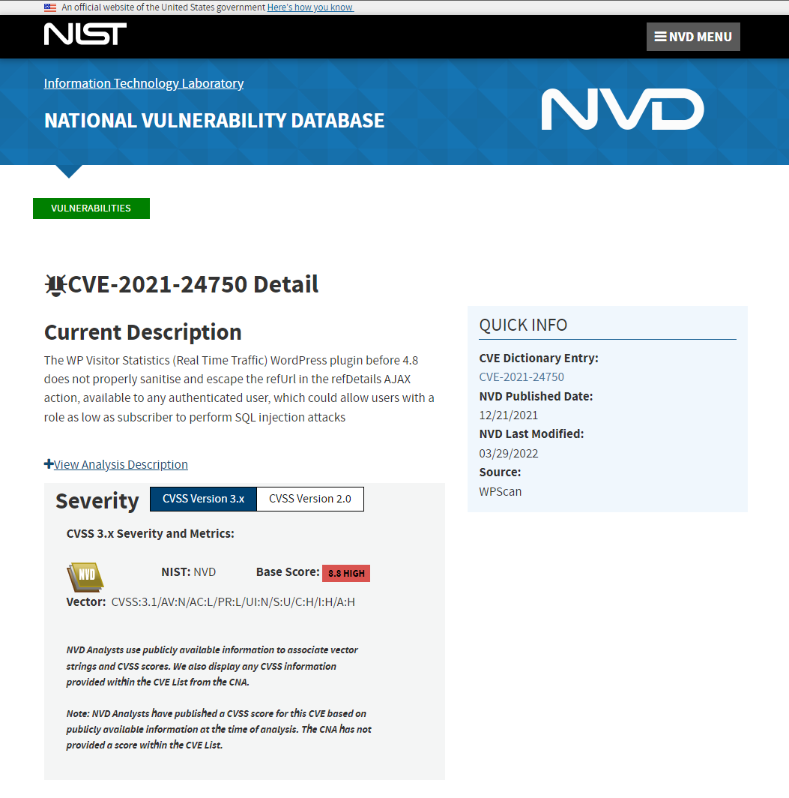

# Challenge 8 Lengthy Logs: Attack Analysis

## Author
    Edna J.
    WGU NICE Challenge
    DAS Webs Inc.
    April 24th, 2022

## Challenge Details
Perform event correlation using information gathered from a variety of sources within the enterprise to gain situational awareness and determine the effectiveness of an observed attack. (T0166)

### Scenario
Lately, employees have been having some issues logging in to one of our Wordpress websites and we can't figure out why. Our security analyst suspects that we might have been hit by a cyber attack, but is currently indisposed and can't look into it. I need you to take a look and confirm whether or not we were actually hit and if so, what the impact of that attack might have been.

-----
## Meeting Briefing

`Rob the Intern @robtheintern`
I tried to log into the WordPress site we are hosting on Prod-Web and couldn't get in. Not sure what's going on, can someone help?! I know I'm typing in my username and password right! I was able to get in yesterday!

`Gilly Bates @gbates`
Did you check your caps lock key? Wouldn't be the first time that's happened.

`Rob the Intern @robtheintern`
Yes I did!! I swear I have it right this time... Actually did you guys ever make my account?

`Gary Thatcher @gthatcher`
@rob actually I left that for @takasaka to do. But I actually can't get in to the website. Something is definitely up. Can we get confirmation by at least one more person?

`Thanh Akasaka @takasaka`
@rob sorry about that, I never got around to it since we have been back to back with projects. Confirmed, no luck for my login on the website either.

`Ione Leventis @ileventis`
Of course something like this would happen while I'm out sick. Especially right after we started allowing outside users to make subscriber accounts. @playerone I'm going to need your assistance here.

`Rob the Intern @robtheintern`
I don't understand how @playerone can even figure anything out if nobody can get into the website!

`Ione Leventis @ileventis`
Take a look at the logs maybe?

`Gilly Bates @gbates`
Yeah and lets not forget our website uses Database for everything. That could have been hit?

`Thanh Akasaka @takasaka`
Why would anything happen to our database? How would anyone even have access to that box?

`Gary Thatcher @gthatcher`
Interesting. @playerone start looking into what happened. I'm fairly certain we've been hit by an attack of some sort but maybe this happened because some part of our website was out of date?

`Thanh Akasaka @takasaka`
If something is wrong with that specific database can't @playerone just use the mysql backup located in /DatabaseBackup on the Backup machine? After all, that thing is backed up nightly.

`Ione Leventis @ileventis`
I mean theoretically yes that might fix the login issues but we need to get to the bottom of what occurred here. @playerone don't worry about restoring the database just figure out what occurred. The logs for the database service should be in 'C:\mysql_logs\' on Database.

`Gilly Bates @gbates`
Hey wait a second! Remember that old incident response form you had me set up a while back @gthatcher? Why don't we have @playerone use it? Seems like the perfect opportunity for this sort of thing! You can find it by navigating to Backup's IP address on a web browser from any machine within our network.

`Gary Thatcher @gthatcher`
Oh yeah! I forgot about that thing. Well there you go @playerone, if you find anything head over to the incident response form that is on the database box and fill it out! If I recall correctly @gbates set it up so that examples are given within the text fields as to how formatting should be done so just follow those! Also, don't use any special characters in the submission title other than the # sign. Just use the format that's given in the example and I'll be happy.

---
## Tools used

 - PowerShell
 - SCP
 - Notepad

## Steps taken to complete the required actions

Starting off, I have the following machines available for me to access and checks left to complete

I was given the following Network diagram map

#### The tasks that I was working on completing were
 - Correctly Reported Exploited Host and Service
 - Correctly Reported Exploited Service Log File Path
 - Correctly Reported Wordpress Account[s] Subjected to Tampering

### Task 1 Correctly Reported Exploited Host and Service

Starting off I navigate to the Database machine (172.16.20.4) and navigate to the folder C:\mysql_logs\ to view the mysql.log file that is on this machine. I don't have a tool installed here to easily view the file, so at first I have a messy text file, that I open with Notepad. 

Next I tried to use PowerShell to better view the log entries. I execute `Select-String -Path C:\mysql_logs\mysql.log -Pattern "Query" and have what seems like a thousand lines displayed. At least it's a bit more organized now. 

### Task 2 Correctly Reported Exploited Service Log File Path

The logs were found exactly as briefed in the meeting at C:\mysql_logs\mysql.log on the Database server.

### Task 3 Correctly Reported Wordpress Account[s] Subjected to Tampering 

I was able to find the backup for the WordPress site located on the Backup machine (172.16.30.79).

I decided to bring the Wordpress.SQL file over to the Security Desk (172.16.30.6) to further examine it. I located the file in DatabaseBackup/wordpress.sql. Then I executed `scp ./wordpress.sql playerone@172.16.30.6:~/wordpress.sql`

Logging into the Security Desk, I quickly found the backup file. I did a couple of grep statements, by using `grep nickname ./wordpress.sql` I was able to find all of the accounts that existed before the breach. 
I noted that the accounts listed were `(1,1,'nickname','playerone')`, `(23,2,'nickname','admin')`, `(41,3,'nickname','gbates')`, and `(55,4,'nickname','takasaka')`

The accounts that were tampered with were playerone, admin, gbates, and takasaka. These were all of the accounts that were on the backup copy, the copy which had not been affected by the breach.

### Form Submission
After completing all of the required steps, I filled out the Incident Response form that was located at http://172.16.30.79 I logged in using my player credentials and filled out the form as follows.

1. Which sytem was breached: **Database**
2. Which service was compromised: **mysql**
3. Full Path to log file: **C:\mysql_logs\mysql.log**
3. Which user accounts were tampered with: **playerone, admin, gbates, takasaka**

#### Describe how the system was breached:
There was a vulnerability that affected this system, it was reported in CVE-2021-24750. 

This is a recently published vulnerability dating from December of last year. It shows that there was an improper neutralization of special elements used in an SQL Command, known as a SQL Injection. I was able to find evidence of this where the attackers were using a know SQL Injection format of "WHERE 1=1" in the logs.

#### How could this incident have been prevented:
The WordPress plugin called WP Visitor Statistics 4.7 does not properly sanitise and escape the refUrl in the refDetails AJAX action,
available to any authenticated user, which could allow users with a role as low as
subscriber to perform SQL injection attacks.
You can test if your site is affected by utilizing this exploit tool for testing (https://github.com/Hacker5preme/Exploits/tree/main/Wordpress/CVE-2021-24750)

In your coding practices, you need to verify that you are sanitising your code and preventing SQL injections. If you are relying on outside tools, such as WordPress plugins, you need to test if these plugins are vulnerable to SQL injections, if you're not able to do it yourself, you can hire a web application penetration tester to do it for you.

#### Recommended course of action after incident occured:
My recommendation is to preserve all logs and information regarding this incident.
Until the plugin is patched, I recommend uninstalling the plugin. I recommend hiring a Web Application Security tester to make sure that there are not any other currently unknown vulnerabilities on the website. 
I recommend restoring the website from the backup copy, that is located on Backup (172.16.30.79), then changing all users passwords and adding multi factor authentication.  

### NICE Framework KSA
    K0004. Knowledge of cybersecurity and privacy principles.
    K0005. Knowledge of cyber threats and vulnerabilities.
    K0042. Knowledge of incident response and handling methodologies.
    K0044. Knowledge of cybersecurity and privacy principles and organizational requirements (relevant to confidentiality, integrity, availability, authentication, non-repudiation).
    K0060. Knowledge of operating systems.
    K0070. Knowledge of system and application security threats and vulnerabilities (e.g., buffer overflow, mobile code, cross-site scripting, Procedural Language/Structured Query Language [PL/SQL] and injections, race conditions, covert channel, replay, return-oriented attacks, malicious code).
    K0161. Knowledge of different classes of attacks (e.g., passive, active, insider, close-in, distribution attacks).
    K0167. Knowledge of system administration, network, and operating system hardening techniques.
    K0192. Knowledge of Windows/Unix ports and services.
    K0297. Knowledge of countermeasure design for identified security risks.
    K0318. Knowledge of operating system command-line tools.

### CAE Knowledge Units
    Cybersecurity Foundations
    Cybersecurity Principles
    Cyber Threats
    Operating Systems Administration
    Operating Systems Concepts
    Vulnerability Analysis

## References:
SQL Injection Cheat sheet - https://www.invicti.com/blog/web-security/sql-injection-cheat-sheet/

CVE-2021-24750 - https://nvd.nist.gov/vuln/detail/CVE-2021-24750