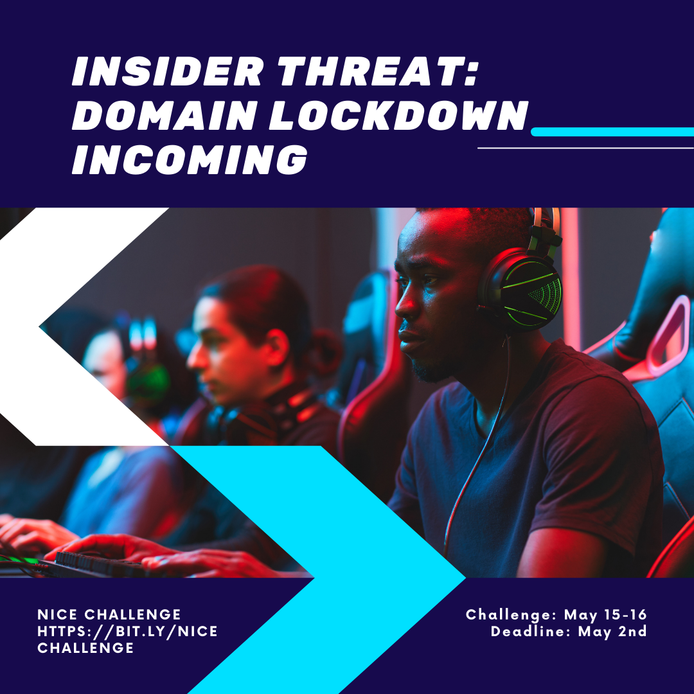
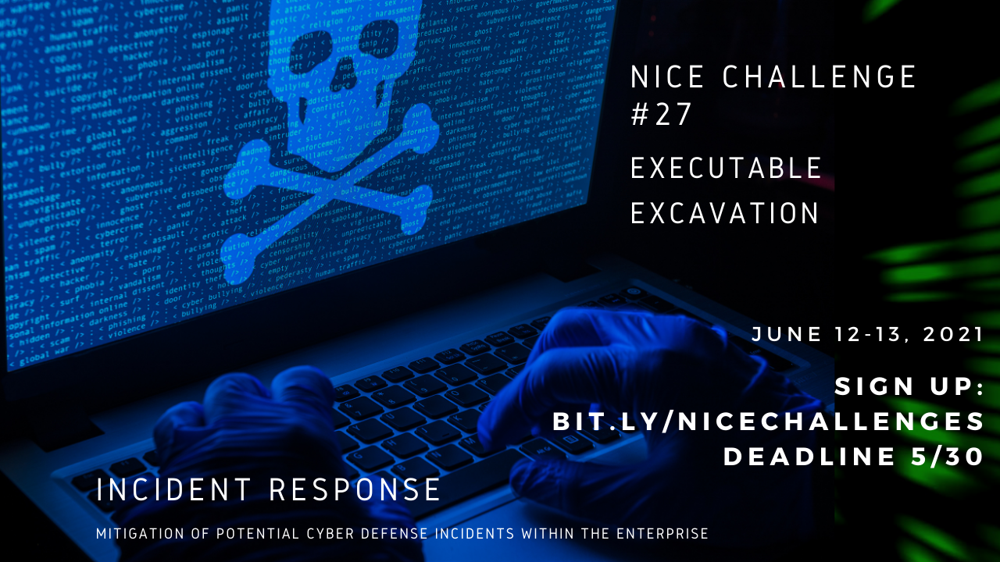
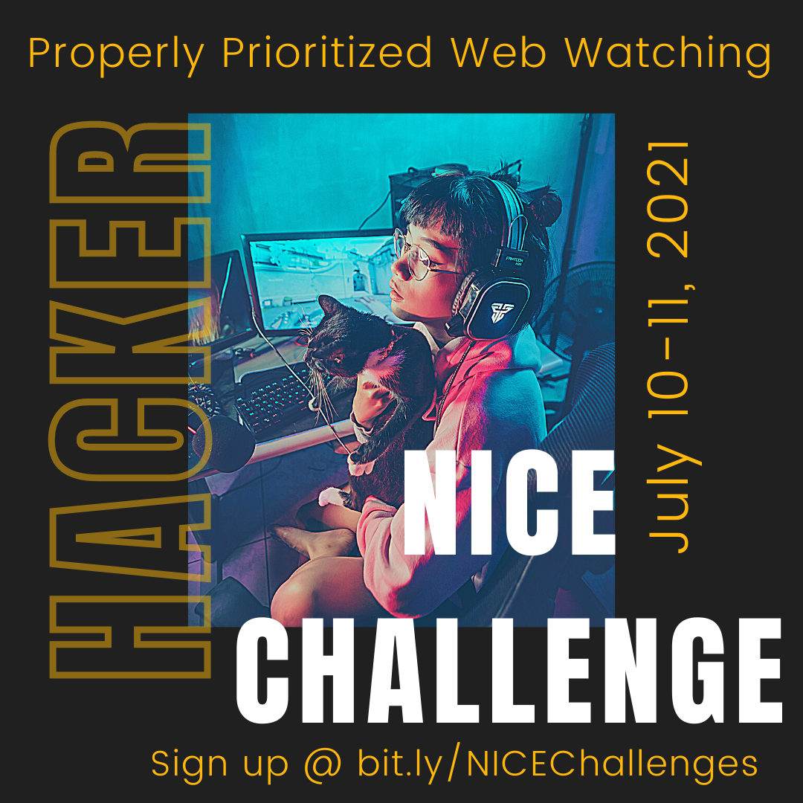
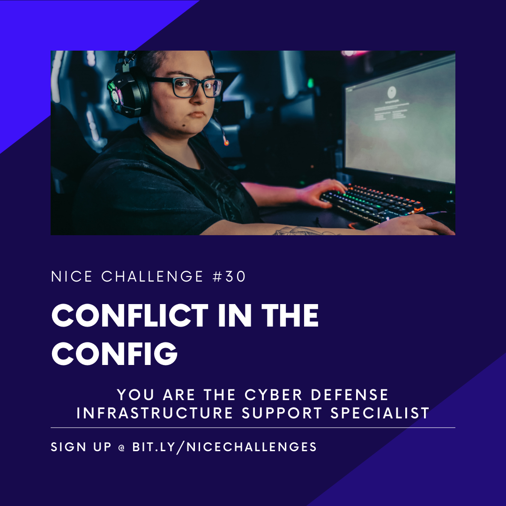
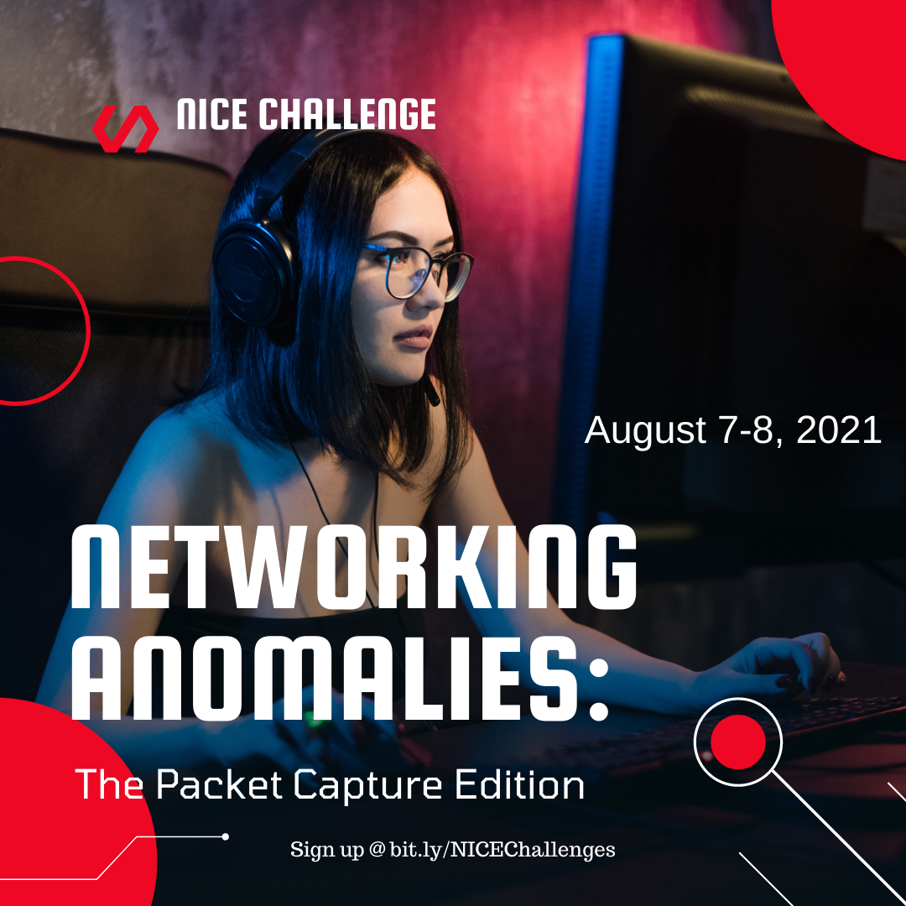

# Immersive Labs

* [About](#about)
* [Lab Write Ups](#Lab-Write-ups)
* [WGU Schedule](#WGU-NICE-Cyber-Challenges-Schedule)

## About

The [NICE Challenge](https://nice-challenge.com/) Project develops real-world cybersecurity challenges within virtualized business environments that bring students the workforce experience before the workforce. Our goal is to provide the most realistic experiences to students, at-scale year-round, while also generating useful assessment data about their knowledge, skills, and abilities for educators.

Below are my Write ups from some of the labs that I have completed.

## Lab Write ups 

[17 Interns & HR on the Domain Controller](./17InternsAndHROnTheDomainController/README.md)

[18 Linux Administration](./18LinuxAdministration201/README.md)

[23 Local Admin No More](./23LocalAdminNoMore-SecurityByDesign/README.md)

[24 Dangerous Drives (Complexity 1)](./24DangerousDrives/README.md)

[25 Insider Threat: Domain Lockdown Incoming](./25InsiderThreat/README.md)

[26 Penetration Testing: Bringing Passwords Up To Snuff](./26PenetrationTesting-Passwords/README.md)

[27 Executable Excavation](./27ExecutableExcavation/README.md)

[28 Digital Duplicates](./28DigitalDuplicates/README.md)

[29 Properly Prioritized Web Watching](./29ProperlyPrioritizedWebWatching/README.md)

[30 Conflict In the Config](./30ConflictInTheConfig/README.md)

[32 Linux Administration 101: Users, Access & Updates](./32LinuxAdministration101/README.md)

### WGU NICE Cyber Challenges Schedule 
May - September 2021

The Nice Cyber Challenges are self learning challenges to provide you hands on experience is DFIR, and PenTesting. Upcoming Challenges and sign-up deadline dates are listed below. Participants must sign-up for each event. Participants are required to at least attempt the challenge. Please reach out to club officers or discord moderators for sign-in issues.

 

### Challenge 24 Dangerous Drives (Complexity 1)
**Date:** 5/1 - 5/02/2021

**Deadline:** 4/18/2021

### Challenge 25 Insider Threat: Domain Lockdown Incoming
**Date:** 5/15 - 5/16/2021

**Deadline:** 05/02/2021

### Challenge 26 Penetration Testing: Bringing Passwords Up To Snuff
**Date:** 5/29 - 5/30/2021

**Deadline:** 05/16/2021

### Challenge 27 Executable Excavation
**Date:** 6/12 - 6/13/2021

**Deadline:** 5/30/2021

### Challenge 28 Digital Duplicates
**Date:** 6/26 - 6/27/2021

**Deadline:** 6/13/2021

### Challenge 29 Properly Prioritized Web Watching (Complexity 1)
**Date:** 7/10 - 7/11/2021

**Deadline:** 6/27/2021

### Challenge 30 Conflict in the Config
**Date:** 7/24 - 7/25/2021

**Deadline:** 07/11/2021

### Challenge 31 Networking Anomalies: The Packet Capture Edition
**Date:** 8/7 - 8/8/2021

**Deadline:** 7/25/2021

 
### Challenge 32 Linux Administration 101: Users, Access & Updates
**Date:** 8/21 - 8/22/2021

**Deadline:** 8/8/2021
 
### Challenge 33 Firewall Update: Tables for Two (Complexity 1)
**Date:** 9/4 - 9/5/2021

**Deadline:** 8/22/2021

### Challenge 34 Systems Security Analyst Crash Course
(*Very challenging*)

**Date:** 9/18 - 9/19/2021

**Deadline:** 9/5/2021

### Challenge 35 Incoming Zero Day! Prepare The IDS/IPS!
**Date:** 10/2 - 10/3/2021

**Deadline:** 9/19/2021
