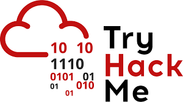

# WriteUps

Here you will find my write ups for Hack The Box, Try Hack Me, Immersive Labs and the NICE Challenge.

## Immersive Labs

[Immersive Labs](https://www.immersivelabs.com/) offers a free account available to students. Taking advantage of this, I've completed quite a few of their labs. 

## NICE Challenge

The [NICE Challenge](https://nice-challenge.com/) Project develops real-world cybersecurity challenges within virtualized business environments that bring students the workforce experience before the workforce. Our goal is to provide the most realistic experiences to students, at-scale year-round, while also generating useful assessment data about their knowledge, skills, and abilities for educators.

## Try Hack Me

[Try Hack Me](https://tryhackme.com/) 

┕ [My THM Profile](https://tryhackme.com/p/ET)

## Hack The Box

[HackTheBox](https://www.hackthebox.eu)

┕ [My HTB Profile](https://www.hackthebox.eu/home/users/profile/299222)

